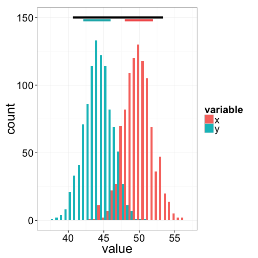
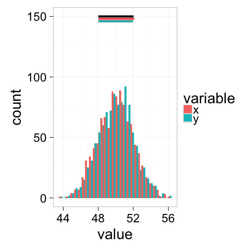

ANOVA
========================================================
incremental:true

Basic Goal of ANOVA
==================

Compare the means of groups that have been sampled randomly, to test whether or not they differ.

The different levels of the categorical variable representing different groups are called **treatments**, which comes from manipulative experiments.

Each observation is called a **replicate** and is assumed to be an indepented observation of the effect of its treatment.

So how do we compare group means?  

Confusingly, it's all about variances (hence ANOVA).

Inituitive Picture of ANOVA
=====================
incremental:false

 

Black bars at top represent variances ignoring groups.

***
 

Colored bars at top represent variances within groups.

The ANOVA linear model
================
$$Y_{ij}=\mu + A_i + \epsilon_{ij}$$

* $\mu$ is the population grand mean ($\bar{Y_{ij}}$ an unbiased MLE estimator of $\mu$)
*  $A_i$ is the additive linear effect compared to the grand meam for a given treatment $i$ ($A_i$‘s sum to 0). 
*  $\epsilon_{ij}$ is the error variance (the variance of individual points around their treatment group means. These are assumed to be distributed $~ N(0,σ2)$).

The steps in a one-way ANOVA
==============
1.  Calculate the Total SS
2.  Calculate the Within-group SS
3.  Calculate the Between-group SS
4.  Calculate Mean Squares using appropriate df.
5.  Calculate the F ratio 
6.  Calculate the p-value

Assumptions of ANOVA
=================

1.  The samples are independent and identically distributed
2.  The residuals $\epsilon_i$ are normally distributed
3.  Within-group variances are similar across all groups (‘homoschedastic”)
4.  Observations are properly categorized in groups

## Supporting assumptions

1. Main effects are additive (no strong interactions). 
2. Balanced design (equal number of observations in all groups). If this is violated, it ceases to be true that Total SS = Within + Between, and the calculations of MSE and F and p-values are all incorrect.

Two-Way ANOVA
==========
$$Y_{ij}=\mu + A_i + B_j + AB_{ij} + \epsilon_{ij}$$
