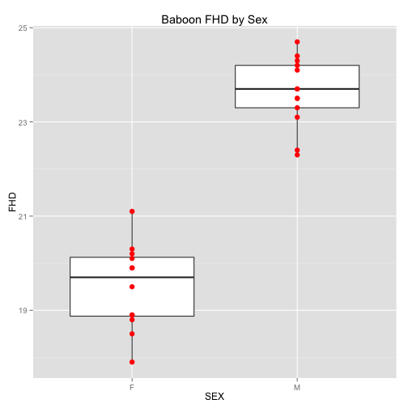

Hypothesis Testing
========================================================

Induction versus Deduction
========================================================

***Induction*** is bottom up approach to reasoning, proceeding from specific observations to general explanations.  

***Deduction*** goes the other way: from general to specific. 

All methods of doing science use both inductive and deductive reasoning, but the emphasis that they receive differs. 

Deduction
========================================================

Deduction 
==============

*  Emphasis is on falsification
*  Requires multiple working hypotheses
*  In the end, there is (hopefully) only one that hasn't been falsified
*  Limitation: "correct" hypothesis MUST be among the alternatives studied

Induction
========================================================

Induction
========================================================

*  Emphasis is on confirmation
*  Builds and modifies hypothesis based on previous knowledge
*  Limitation: may "get off on wrong foot" if hypothesis is just plain wrong

Testing Hypotheses
================

Consider a [fake dataset of body mass and femoral head diameters](datasets/baboons.txt) from male and female baboons. 

 Read this into R on your own, and make a boxplot like this, with the points overlaid on the boxes. 

***

 

[xkcd]: frequentists_vs_bayesians.png
[errors]: typeItype2.jpg
[inductive]: inductive.png
[hypothetico]: hypothetico_deductive.png
