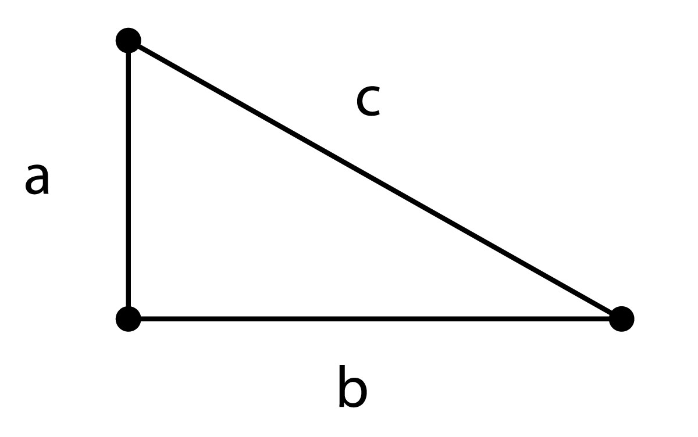
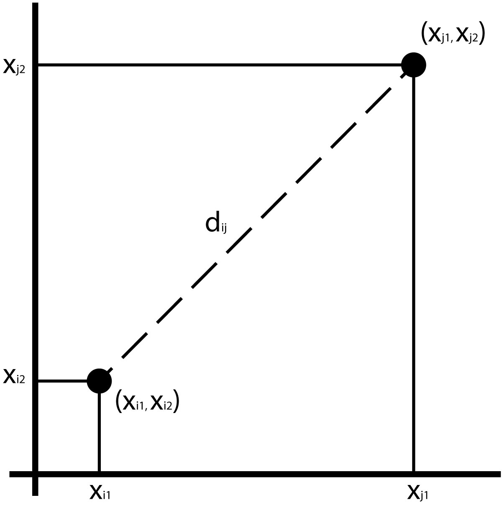
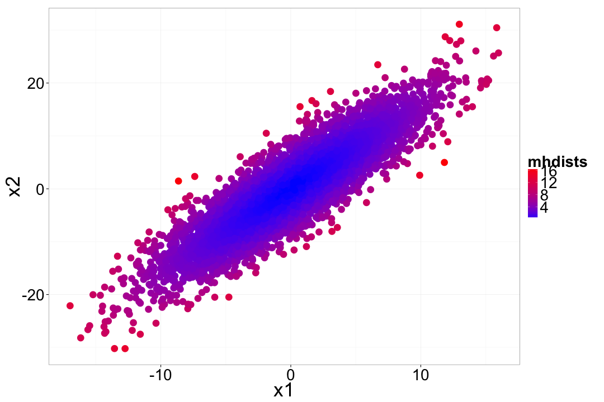

Multivariate Statistics
========================================================
incremental:true


Multivariate Data
===================

Often we collect many different variables

We want to answer questions like:

*  how are the variables related?
*  are their differences in the means and variances of the variables?
*  can we look at a composite of some of these variables to simplify our data?

### This is the domain of multivariate statistics

Matrix Algebra
================

## The nuts and bolts of multivariate statistics

## You need to know the basics (at least the terminology) in order to understand multivariate stats.

A matrix
================

$$A = \left[\begin{array}{cccc}
a_{11} & a_{12} & .. & a_{1n} \\
a_{21} & a_{22} & .. & a_{2n} \\
.. & .. & .. & ..\\
a_{m1} & a_{m2} & .. & a_{mn} \end{array}\right]
$$ 

*  Consists of $m$ rows and $n$ columns
*  if $m=n$ then it is a **square matrix**
*  each row is a **row vector**
*  each column is a **column vector**
*  a single number is called a **scalar**
*  matrices are represented by capital letters

Matrix Transposition
==========

Matrices can be transposed by swapping the rows and columns

$$A = \left[\begin{array}{cc}
a & b\\
c & d  \\
e & f \end{array}\right]
$$ 

becomes

$$A' = \left[\begin{array}{ccc}
a & c & e\\
b & d & f  \end{array}\right]
$$ 

Types of Matrices
============

**Zero matrix** $$0 = \left[\begin{array}{ccc}
0 & 0 & 0\\
0 & 0 & 0 \\
0 & 0 & 0\end{array}\right]
$$

**Diagonal matrix** $$D = \left[\begin{array}{ccc}
d_1 & 0 & 0\\
0 & d_2 & 0 \\
0 & 0 & d_3\end{array}\right]
$$

A **Symmetrical matrix** is a square matrix whose transpose is identical to the original.

Types of Matrices
============

**Diagonal matrix** $$D = \left[\begin{array}{ccc}
d_1 & 0 & 0\\
0 & d_2 & 0 \\
0 & 0 & d_3\end{array}\right]
$$

**Identity matrix** $$I = \left[\begin{array}{ccc}
1 & 0 & 0\\
0 & 1 & 0 \\
0 & 0 & 1\end{array}\right]
$$

Operations on Matrices
===========

**Equality** - Two matrices are equal only if they have same size, and all elements are equal. 

**Trace** - The sum of the diagonal terms.

Addition, subtraction, multiplication and division all have their matrix counterparts. 

Eigenvalues and Eigenvectors
=============

Consider a system of linear equations, where $\lambda$ is a scalar:

$$a_{11}x_1 + a_{12}x_2 + ... + a_{1n}x_n = \lambda x_1 \\
a_{21}x_1 + a_{22}x_2 + ... + a_{2n}x_n = \lambda x_2\\
... \\
a_{n1}x_1 + a_{n2}x_2 + ... + a_{nn}x_n = \lambda x_n$$

We can write this in matrix form. 

$$Ax = \lambda x$$ or $$ (A - \lambda I)x = 0$$

Eigenvalues and Eigenvectors
=============

These equations only hold true for some values of $\lambda$, which are called the **eigenvalues**.  

There are up to $n$ eigenvalues. 

These equations can be solved for a given eigenvalue (e.g., the $ith$), and the resulting set of values is called the $ith$ **eigenvector**.

The sum of the eigenvalues of matrix $A$ is equal to the trace of matrix $A$.

Covariance Matrices
================
Recall the **sample covariance** for two variables, calculated from the sum of cross-products 

$$\ s_{XY} = \frac{\sum\limits_{i=1}^n(X_i - \bar{X})(Y_i - \bar{Y})}{(n-1)}$$

Covariance Matrices
================

With a multivariate sample comprising $p$ variables, we can define a sample **covariance matrix**:

$$ S = \left[\begin{array}{ccc}
s_{11} & s_{12} & .. & s_{1p}\\
s_{21}& s_{22} & .. & s_{2p} \\
.. & .. & .. & .. \\
s_{p1} & s_{p2} & .. &  s_{pp} \end{array}\right]$$

## What do the diagonal elements represent?

Covariance Matrices
================

```r
x <- rnorm(100)
y <- x * 0.3 + rnorm(100, sd=0.4)
z <- rnorm(100)
myMatrix <- cbind(x,y,z)
var(myMatrix)
```

```
           x          y           z
x  0.8991261 0.32066583 -0.11048828
y  0.3206658 0.26901996  0.01558829
z -0.1104883 0.01558829  1.03292792
```

Correlation Matrices
==========

Recall the **correlation coeffiecient** for two variables, which is a scaled version of the  covariance.

$$ correlation\ coeffiecient = \frac{cov\ XY}{(sd\ X \times sd\ Y)}$$

or more formally:

$$ r = \frac{s_{xy}}{(s_{X} \times s_{Y})}$$

Correlation Matrices
==========

We can then compute the correlation matrix for a multivariate sample of $p$ variables.

$$ R = \left[\begin{array}{cccc}
1 & r_{12} & .. &  r_{1p}\\
r_{21}& 1 & .. & r_{2p} \\
.. & .. &  .. & .. \\
r_{p1} & r_{p2} &  .. & 1 \end{array}\right]$$

## Why are the diagonal elements all 1?

Correlation Matrices
==========

```r
head(myMatrix, 4)
```

```
             x          y          z
[1,] -1.674880 -1.4611746 -0.2141604
[2,]  0.291600  0.7792458  1.1623441
[3,] -1.529140 -0.5778999 -1.1890373
[4,]  1.120506  0.8515696  0.8094828
```

```r
cor(myMatrix)
```

```
           x          y           z
x  1.0000000 0.65200380 -0.11464916
y  0.6520038 1.00000000  0.02957135
z -0.1146492 0.02957135  1.00000000
```

Multivariate Distance Metrics
=============

With a single variable (e.g. femur length) it is easy to conceptualize how far apart two observations are.

*  Femur A = 25cm
*  Femur B = 30cm
*  How far apart are these individuals in terms of femoral length?

As we add more measurements, it becomes less obvious to tell how "far apart" two specimens are.

We need a multivariate distance metric.

Euclidian Distance
=============
incremental:false
left:70



*** 
$$z = \sqrt{a^2 + b^2 }$$

Euclidian Distance
=============
incremental:false



*** 

Assuming 2 variables, we can compute the distance as the hypotenuse of a triangle:

$$d_{ij} =\sqrt{(x_{i1} - x_{j1})^2 + (x_{i2} - x_{j2})^2}$$

Euclidian Distance
=============
We can compute a Euclidian distance for any number of variables:

$$d_{ij} = \sum\limits_{k=1}^p \sqrt{ (x_{ik})^2 - (x_{jk})^2 }$$

Euclidian Distance
=============

Euclidian distances can easily be swamped by large scale measurements.

To avoid this, you can calculate a **z score** by subtracting the mean of the measurement and dividing by the standard deviation.

The `dist()` function in R calculates Euclidian distances by default.

Mahalanobis Distance
=============

Calculates the distance of an observation from its multivariate sample, taking into account the covariance of the variables.  

$$D^2_{ij} = \sum\limits_{r=1}^p \sum\limits_{s=1}^p (x_{r} - \mu_{r})\ v^{rs} (x_{s} - \mu_{s})$$

where $v^{rs}$ is the covariance between variables $r$ and $s$

Mahalanobis Distance
=============

 


Mahalanobis Distance
===================

```r
means <- c(mean(x1), mean(x2))
myMatrix <- cbind(x1, x2)
VCV <- var(myMatrix)
```


```r
mhdists <- mahalanobis(myMatrix, means, VCV)
mhdists[1:4]
```

```
[1] 2.1335285 0.1871506 2.1965283 5.6212356
```

Distance Matrices
==================


```r
var1 <- rnorm(5); var2 <- rnorm(5)
myMatrix <- cbind(var1,var2); head(myMatrix, 3)
```

```
           var1       var2
[1,] -1.8168975 -0.4935965
[2,]  0.6271668 -2.1222441
[3,]  0.5180921 -0.1335666
```

Distance Matrices
==================

## Euclidian Distance Matrix


```r
dist(myMatrix)
```

```
          1         2         3         4
2 2.9369957                              
3 2.3625829 1.9916665                    
4 1.9589314 1.7630234 0.4782398          
5 3.3253874 2.3607936 0.9649143 1.4136512
```


Cluster Analysis
==================

Discriminant Function Analysis
=================
