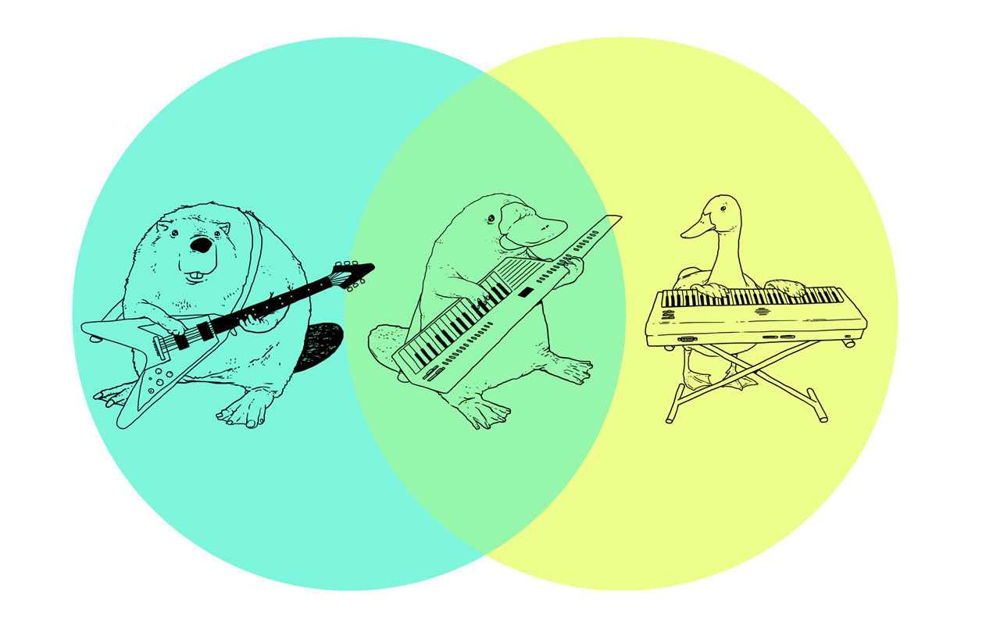
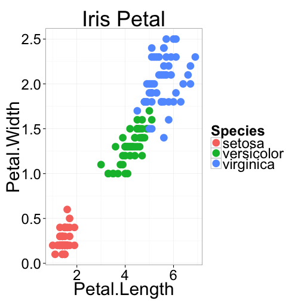
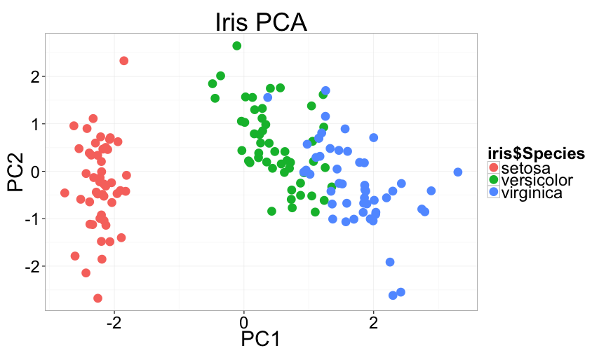

Multivariate Stats II
========================================================
incremental:true


Principal Components Analysis
========================================================

## Goal is to "summarize" variation in multivariate data

## Reduce the number of dimensions needed to describe most of the variance

Principal Components Analysis in R
===================

### There are 2 functions in R

*  `prcomp()`
*  `princomp()`

### These differ in their implementation, but provide similar results. 

### However, according to the help files `prcomp()` is preferred for numerical accuracy

PCA - Learn by Example
==============
incremental:false

 

***

 

PCA - Learn by Example
==============
incremental:false


```r
irisPCA <- prcomp(iris[,1:4], 
                  scale=TRUE, center=TRUE)
summary(irisPCA)
```

                     |     PC1  |  PC2   |  PC3   |  PC4
---------------------|---------|--------|--------|------
Standard deviation  |   1.7084  | 0.9560  | 0.38309 |  0.14393
Proportion of Variance | 0.7296 |  0.2285 |  0.03669 |  0.00518
Cumulative Proportion | 0.7296  | 0.9581  | 0.99482  | 1.00000


PCA - Learn by Example
===========
incremental:false

 

PCA - more details
===================

*  We start with $p$ variables for $n$ individuals
*  The first PC is the linear combination of all the variables:
*  $PC1 = a_1X_1 + a_2X_2 + ... + a_pX_p$
*  PC1 is chosen to vary as much as possible for all the individuals, subject to the condition that the sum of the squared $a$ terms is 1
*  Subsequent PCs are uncorrelated with the prior PCs

PCA - even more details
================

1.  **scale** and **center** your variables to have a mean of 0 and variance of 1.
2.  Calculate the covariance matrix (this will be a correlation matrix if you did step 1)
3.  Find the eigenvalues (variances of the PCs) and corresponding eigenvectors (the loadings for each variable) for the covariance/correlation matrix
4.  Ignore the components that (hopefully) explain very little variance, and focus on the first few components


