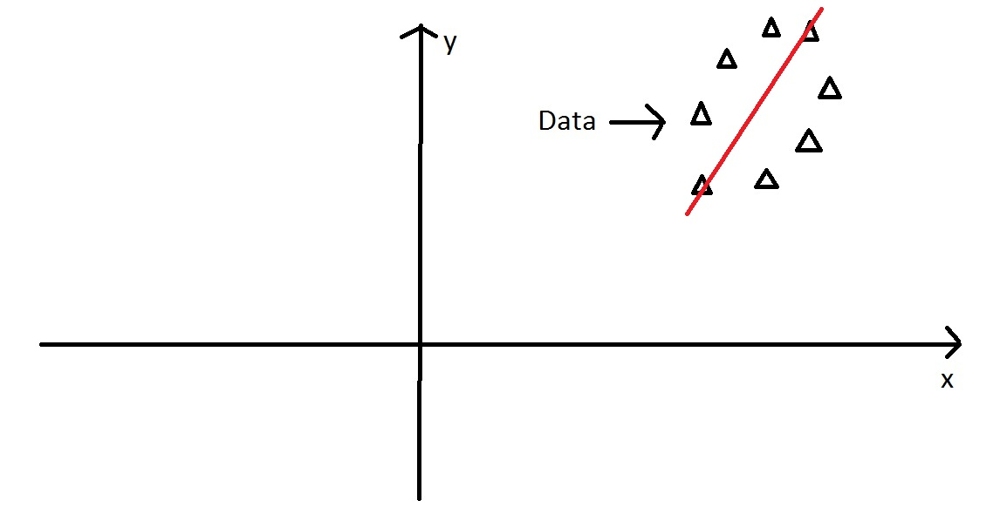
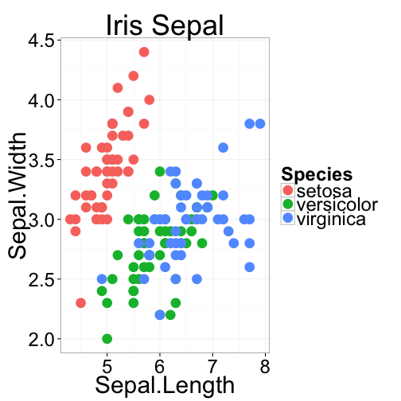

Multivariate Stats II
========================================================
incremental:true


Principal Components Analysis
========================================================

## Goal is to "summarize" variation in multivariate data

## Reduce the number of dimensions needed to describe most of the variance

PCA - Intuitively
========
incremental:false
right:80

Start with some data points

***


PCA - Intuitively
========
incremental:false
right:80

Project the variance on to some axis

***


PCA - Intuitively
========
incremental:false
right:80

This one has much more variance...

***


PCA - Intuitively
========
incremental:false
right:80

Imagine these points in some XY coordinate system....

***


PCA - Intuitively
========
incremental:false
right:80

We can still find the axis of maximum variation....

***



PCA - Intuitively
========
incremental:false
right:80

Then we find the orthogonal axis, 90$^\circ$ from major axis

***


PCA - Intuitively
========
incremental:false
right:80

Next, we rotate the data to use the two axes we found...

These are our principal components axes....

***


PCA - operationally
==========

*  Starting with the covariance matrix
*  The eigenvalues of this matrix are the variances explained by each PC
*  The eigenvectors of this matrix are the contributions of each original variable to the PC
*  The eigenvectors can be thought of as "transformation equations" to convert a datapoint from the original space to the PC space

PCA - more details
===================

*  We start with $p$ variables for $n$ individuals
*  The first PC is the linear combination of all the variables:
*  $PC1 = a_1X_1 + a_2X_2 + ... + a_pX_p$
*  PC1 is chosen to vary as much as possible for all the individuals, subject to the condition that the sum of the squared $a$ terms is 1
*  Subsequent PCs are uncorrelated with the prior PCs

PCA - even more details
================

1.  (sometimes) **scale** and **center** your variables to have a mean of 0 and variance of 1.
2.  Calculate the covariance matrix (this will be a correlation matrix if you did step 1)
3.  Find the eigenvalues (variances of the PCs) and corresponding eigenvectors (the loadings for each variable) for the covariance/correlation matrix
4.  Ignore the components that (hopefully) explain very little variance, and focus on the first few components

Principal Components Analysis in R
===================

### There are 2 functions in R

*  `prcomp()` 
*  `princomp()`

### These differ in their implementation, but provide similar results. 

### However, `prcomp()` is preferred for numerical accuracy

PCA - Learn by Example
==============
incremental:false

 

***

 

PCA - Learn by Example
==============
incremental:false


```r
irisPCA <- prcomp(iris[,1:4], 
                  scale=TRUE, center=TRUE)
summary(irisPCA)
```

                     |     PC1  |  PC2   |  PC3   |  PC4
---------------------|---------|--------|--------|------
Standard deviation  |   1.7084  | 0.9560  | 0.38309 |  0.14393
Proportion of Variance | 0.7296 |  0.2285 |  0.03669 |  0.00518
Cumulative Proportion | 0.7296  | 0.9581  | 0.99482  | 1.00000


PCA - Learn by Example
===========
incremental:false

 


Correspondence Analysis
==============

*  A method for visualizing a 2-way contingency table

*  The goal is to have rows (often taxa) and colums (often sites) appear in same ordination plot

*  Often called ***reciprocal averaging***

*  Site scores are weighted averages of species values, and species scores are a weighted average of site values

*  useful for count data and presence/absence

Correspondence Analysis
============


```r
bovids[,1:5]
```

```
             site1 site2 site3 site4 site5
Aepyceros      155   219   214   183   295
Connochaetes   185   281   297   276   136
Gazella        184   291   313   295    95
Tragelaphus     91   145   145   155   229
```

Correspondence Analysis
============
incremental:false
left:30

*  Row points (red) appear close to rows with similar column values
*  Column points (blue) appear close to columns with similar row values

***

 

