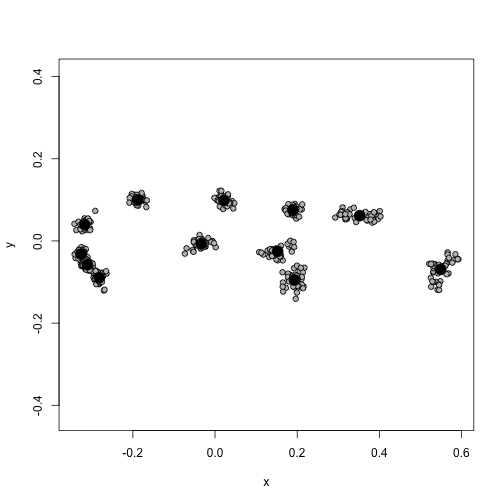

Multivariate Stats III
========================================================
incremental:true

Geometric Morphometrics (GM)
=================
incremental:false 


***

## involves the analysis of Cartesian geometric coordinates rather than length, area, volume measurements

Steps in a GM analysis
================

## use `geomorph` package in R

1.  Get coordinate data (e.g., digitize outline from a photo, use a microscribe, get 3D coordinates from laser scanned specimen, etc)
2.  Perform a Generalized Procrustes Analysis (GPA)
3.  Analyze and visualze the results from the GPA

GM - Step 1 - Coordinates
================
left:65


***

*  involves capturing homologous ***landmarks*** or ***semi-landmarks***
*  can be 2D or 3D
*  each specimen will have a unique ***configuration*** of landmarks in its own coordinate system

GM - Step 1 - Coordinates
================

## We will use 2D coordinate data of salamander head shape

## note that the landmark is in a $p \times k \times n$ array


```r
library(geomorph)
data(plethodon)
str(plethodon$land)
```

```
 num [1:12, 1:2, 1:40] 8.89 9.27 5.56 1.87 1.28 ...
 - attr(*, "dimnames")=List of 3
  ..$ : NULL
  ..$ : NULL
  ..$ : NULL
```

GM - Step 2 - Procrustes
=================


GM - Step 2 - Procrustes
=================

## Translates all configurations to the origin
## scales them to centroid size
## rotates them until the ***Procrustes distance*** between configurations is minimized

***

## 


GM - Step 2 - Procrustes
=================
incremental:false


```r
GPA_pleth <- gpagen(plethodon$land)
```

 

***


```r
GPA_pleth
```

```
$coords
, , 1

             [,1]         [,2]
 [1,]  0.18674487 -0.026016201
 [2,]  0.21065424 -0.092571777
 [3,] -0.03230658  0.005234669
 [4,] -0.27638984 -0.087843260
 [5,] -0.31497263 -0.058779525
 [6,] -0.31749585 -0.049606121
 [7,] -0.34224908  0.041576950
 [8,] -0.17653781  0.109650590
 [9,]  0.01698921  0.103374585
[10,]  0.18676160  0.071420748
[11,]  0.31041193  0.081513945
[12,]  0.54838993 -0.097954603

, , 2

             [,1]        [,2]
 [1,]  0.18020244 -0.01375046
 [2,]  0.19225698 -0.06626592
 [3,] -0.03775392  0.01460057
 [4,] -0.28638919 -0.09389861
 [5,] -0.31598805 -0.06785505
 [6,] -0.32658961 -0.05323623
 [7,] -0.32452817  0.03007894
 [8,] -0.17849692  0.11166579
 [9,]  0.02376817  0.09980367
[10,]  0.19584000  0.08299531
[11,]  0.33990156  0.05571632
[12,]  0.53777670 -0.09985433

, , 3

             [,1]         [,2]
 [1,]  0.18255175 -0.001288594
 [2,]  0.19947571 -0.060293365
 [3,] -0.04463995  0.002246776
 [4,] -0.28813027 -0.103115091
 [5,] -0.31504500 -0.065422644
 [6,] -0.32638565 -0.047548110
 [7,] -0.32376071  0.036006207
 [8,] -0.18473848  0.095623204
 [9,]  0.03123453  0.109934477
[10,]  0.19574912  0.082580443
[11,]  0.34770955  0.062748319
[12,]  0.52597938 -0.111471623

, , 4

             [,1]         [,2]
 [1,]  0.18126374 -0.007087741
 [2,]  0.19735107 -0.088221985
 [3,] -0.04332814 -0.001071519
 [4,] -0.27045492 -0.120759146
 [5,] -0.30814805 -0.072036847
 [6,] -0.32496136 -0.033728418
 [7,] -0.31145042  0.048600016
 [8,] -0.19607279  0.104416420
 [9,]  0.01110537  0.122032235
[10,]  0.19428305  0.090051641
[11,]  0.32898793  0.076567884
[12,]  0.54142453 -0.118762541

, , 5

             [,1]         [,2]
 [1,]  0.18389651 -0.009855568
 [2,]  0.20596516 -0.074421749
 [3,] -0.01637312  0.001144396
 [4,] -0.28207467 -0.105303552
 [5,] -0.32545123 -0.060972062
 [6,] -0.33180052 -0.037899399
 [7,] -0.33233863  0.046771271
 [8,] -0.19405592  0.093961676
 [9,]  0.04150534  0.097072861
[10,]  0.21107694  0.076637516
[11,]  0.30838435  0.072636092
[12,]  0.53126578 -0.099771481

, , 6

             [,1]         [,2]
 [1,]  0.17647808 -0.007174566
 [2,]  0.19430909 -0.081988549
 [3,] -0.05148704  0.001705582
 [4,] -0.27439187 -0.088359969
 [5,] -0.29728722 -0.061385168
 [6,] -0.32034567 -0.050805870
 [7,] -0.32529553  0.033174953
 [8,] -0.19803933  0.097154093
 [9,]  0.01466908  0.112858936
[10,]  0.19829203  0.083320436
[11,]  0.33774937  0.080809359
[12,]  0.54534904 -0.119309238

, , 7

             [,1]          [,2]
 [1,]  0.18325176  0.0004012088
 [2,]  0.21748339 -0.0651977550
 [3,] -0.02911167 -0.0056517450
 [4,] -0.29564352 -0.0891356011
 [5,] -0.32187067 -0.0539204404
 [6,] -0.33289871 -0.0388164772
 [7,] -0.32300983  0.0318935125
 [8,] -0.18700996  0.0858541056
 [9,]  0.02864366  0.0931964475
[10,]  0.19146690  0.0853359723
[11,]  0.34348061  0.0459144148
[12,]  0.52521805 -0.0898736428

, , 8

              [,1]          [,2]
 [1,]  0.160500212 -0.0117686522
 [2,]  0.213706588 -0.0764442232
 [3,] -0.006333051 -0.0002907979
 [4,] -0.283651074 -0.1040050494
 [5,] -0.316514213 -0.0599753884
 [6,] -0.327886639 -0.0298945087
 [7,] -0.325650216  0.0362440911
 [8,] -0.193756395  0.0952174793
 [9,]  0.026656774  0.1036442541
[10,]  0.185751946  0.0840411552
[11,]  0.322301661  0.0691418531
[12,]  0.544874408 -0.1059102130

, , 9

             [,1]         [,2]
 [1,]  0.19269714 -0.014672528
 [2,]  0.21132193 -0.087468300
 [3,] -0.05117429 -0.003999322
 [4,] -0.27356168 -0.086668083
 [5,] -0.30391268 -0.066292043
 [6,] -0.33945246 -0.041642353
 [7,] -0.32777738  0.039324768
 [8,] -0.19326157  0.102722668
 [9,]  0.02253152  0.098745860
[10,]  0.21222030  0.089063552
[11,]  0.32155189  0.069376016
[12,]  0.52881727 -0.098490235

, , 10

             [,1]          [,2]
 [1,]  0.19126076 -0.0023990568
 [2,]  0.20890735 -0.0652913470
 [3,] -0.03199424 -0.0003829667
 [4,] -0.28902424 -0.1051947413
 [5,] -0.31438274 -0.0690835676
 [6,] -0.32184140 -0.0364460098
 [7,] -0.31911173  0.0447711882
 [8,] -0.18977919  0.1004185020
 [9,]  0.01178104  0.1008172700
[10,]  0.18804123  0.0869322859
[11,]  0.32082232  0.0533342563
[12,]  0.54532083 -0.1074758134

, , 11

             [,1]        [,2]
 [1,]  0.16467688 -0.04733453
 [2,]  0.21008576 -0.11292943
 [3,] -0.05319256 -0.02509686
 [4,] -0.29544043 -0.07807980
 [5,] -0.31013930 -0.03939577
 [6,] -0.32718818 -0.01862130
 [7,] -0.31729080  0.04826508
 [8,] -0.17028741  0.09606758
 [9,]  0.01664749  0.08142170
[10,]  0.19416722  0.06516821
[11,]  0.32181275  0.05833124
[12,]  0.56614859 -0.02779610

, , 12

             [,1]        [,2]
 [1,]  0.15269022 -0.04717605
 [2,]  0.21549686 -0.11080379
 [3,] -0.05463264 -0.02192780
 [4,] -0.26402971 -0.07951508
 [5,] -0.30924402 -0.04699070
 [6,] -0.33025420 -0.01995736
 [7,] -0.31773523  0.05493243
 [8,] -0.18535258  0.10356243
 [9,]  0.01162728  0.08374098
[10,]  0.19380112  0.06012422
[11,]  0.30699723  0.07071242
[12,]  0.58063568 -0.04670171

, , 13

             [,1]        [,2]
 [1,]  0.15164845 -0.03955838
 [2,]  0.19409078 -0.11299096
 [3,] -0.04667710 -0.01087029
 [4,] -0.29002797 -0.08387974
 [5,] -0.31932329 -0.04245261
 [6,] -0.32472668 -0.02346167
 [7,] -0.30694001  0.05006303
 [8,] -0.17183734  0.10005427
 [9,]  0.02011047  0.07776225
[10,]  0.19764709  0.05427087
[11,]  0.31110234  0.06343012
[12,]  0.58493326 -0.03236689

, , 14

             [,1]        [,2]
 [1,]  0.14463511 -0.03244279
 [2,]  0.21180854 -0.10666049
 [3,] -0.07324676 -0.03087376
 [4,] -0.28163057 -0.10009517
 [5,] -0.31017436 -0.06332941
 [6,] -0.32563577 -0.01514785
 [7,] -0.29137893  0.07313414
 [8,] -0.19402843  0.11238720
 [9,]  0.04447432  0.07893652
[10,]  0.19028622  0.07166393
[11,]  0.29263235  0.05697791
[12,]  0.59225829 -0.04455023

, , 15

             [,1]        [,2]
 [1,]  0.16044617 -0.03460054
 [2,]  0.19915606 -0.12565762
 [3,] -0.03905887 -0.01060002
 [4,] -0.28430952 -0.07674497
 [5,] -0.30816941 -0.05716961
 [6,] -0.34167340 -0.03253668
 [7,] -0.31746523  0.04860578
 [8,] -0.17930589  0.10265165
 [9,]  0.04692311  0.09188330
[10,]  0.19448912  0.07682850
[11,]  0.30259567  0.06443513
[12,]  0.56637219 -0.04709491

, , 16

             [,1]        [,2]
 [1,]  0.15094007 -0.02349199
 [2,]  0.19640349 -0.14081519
 [3,] -0.03439479 -0.00768358
 [4,] -0.29370848 -0.09366095
 [5,] -0.31253687 -0.04927485
 [6,] -0.32500113 -0.02197107
 [7,] -0.31357460  0.05117363
 [8,] -0.17778488  0.10075523
 [9,]  0.02710036  0.08794535
[10,]  0.19953683  0.07745296
[11,]  0.31715812  0.05250596
[12,]  0.56586189 -0.03293550

, , 17

             [,1]        [,2]
 [1,]  0.15914669 -0.03895593
 [2,]  0.20338199 -0.11047001
 [3,] -0.05244287 -0.02654089
 [4,] -0.27960161 -0.08777533
 [5,] -0.30364099 -0.05284194
 [6,] -0.31839098 -0.01846140
 [7,] -0.31479192  0.04281880
 [8,] -0.20252040  0.11445820
 [9,]  0.03276758  0.09324575
[10,]  0.18436874  0.07317775
[11,]  0.32734640  0.06479038
[12,]  0.56437736 -0.05344538

, , 18

             [,1]         [,2]
 [1,]  0.14929530 -0.045128786
 [2,]  0.20046680 -0.109654080
 [3,] -0.05156028 -0.002184208
 [4,] -0.27185148 -0.084801570
 [5,] -0.30661509 -0.055725671
 [6,] -0.33521769 -0.026586417
 [7,] -0.31772858  0.048603272
 [8,] -0.18936574  0.105509580
 [9,]  0.03691554  0.093578160
[10,]  0.19833726  0.062400245
[11,]  0.31774864  0.055256760
[12,]  0.56957532 -0.041267285

, , 19

             [,1]        [,2]
 [1,]  0.13516669 -0.03230285
 [2,]  0.21414410 -0.11513996
 [3,] -0.06930436 -0.01782290
 [4,] -0.28248278 -0.08808328
 [5,] -0.31528722 -0.05114498
 [6,] -0.32180201 -0.02276128
 [7,] -0.30258216  0.04612768
 [8,] -0.18376196  0.10095132
 [9,]  0.03626906  0.09258869
[10,]  0.20686261  0.07660646
[11,]  0.30551536  0.06376345
[12,]  0.57726268 -0.05278237

, , 20

             [,1]        [,2]
 [1,]  0.11749814 -0.03321217
 [2,]  0.19373566 -0.09726630
 [3,] -0.03501211 -0.01859668
 [4,] -0.29408418 -0.07888792
 [5,] -0.31457920 -0.04336295
 [6,] -0.33149171 -0.02247384
 [7,] -0.30662214  0.04566841
 [8,] -0.16729081  0.08249272
 [9,]  0.02556004  0.08585998
[10,]  0.20465325  0.05886128
[11,]  0.31712616  0.06523908
[12,]  0.59050690 -0.04432162

, , 21

             [,1]        [,2]
 [1,]  0.14342687 -0.03602267
 [2,]  0.19035254 -0.11102137
 [3,] -0.02313542 -0.01386212
 [4,] -0.27431923 -0.07732565
 [5,] -0.30719423 -0.05355698
 [6,] -0.32699104 -0.03107581
 [7,] -0.32161255  0.03881561
 [8,] -0.19389754  0.09966218
 [9,]  0.01559289  0.09676393
[10,]  0.16921136  0.07732237
[11,]  0.39256059  0.06718195
[12,]  0.53600576 -0.05688144

, , 22

             [,1]         [,2]
 [1,]  0.13162109 -0.039079518
 [2,]  0.16530200 -0.101031721
 [3,] -0.03437309 -0.009735688
 [4,] -0.28137904 -0.080381958
 [5,] -0.31046942 -0.055209112
 [6,] -0.32538145 -0.036073808
 [7,] -0.30386613  0.030309316
 [8,] -0.18482275  0.097530321
 [9,]  0.01732498  0.104231228
[10,]  0.17976365  0.081583114
[11,]  0.40096996  0.072648689
[12,]  0.54531020 -0.064790863

, , 23

             [,1]        [,2]
 [1,]  0.14776301 -0.01833828
 [2,]  0.18862189 -0.09693153
 [3,] -0.04395613 -0.01020102
 [4,] -0.28892327 -0.08465770
 [5,] -0.31227566 -0.06037067
 [6,] -0.32381027 -0.03090736
 [7,] -0.31372985  0.02638979
 [8,] -0.18318240  0.09498276
 [9,]  0.02662643  0.10183541
[10,]  0.18773878  0.08800378
[11,]  0.38454264  0.06663006
[12,]  0.53058483 -0.07643524

, , 24

              [,1]         [,2]
 [1,]  0.153590260 -0.022365300
 [2,]  0.181883000 -0.082027066
 [3,] -0.024938806 -0.008769988
 [4,] -0.282643099 -0.095218582
 [5,] -0.313278523 -0.069960986
 [6,] -0.327177258 -0.028680419
 [7,] -0.312519804  0.044828101
 [8,] -0.186660472  0.101246684
 [9,]  0.005241146  0.098861495
[10,]  0.185108026  0.072124592
[11,]  0.389941918  0.064535898
[12,]  0.531453612 -0.074574428

, , 25

              [,1]         [,2]
 [1,]  0.134986337 -0.029453935
 [2,]  0.194170809 -0.096131443
 [3,] -0.023216642 -0.007438428
 [4,] -0.276316549 -0.095047716
 [5,] -0.302587419 -0.058755422
 [6,] -0.323116401 -0.032273267
 [7,] -0.317524505  0.035297497
 [8,] -0.193266099  0.106862243
 [9,]  0.007228486  0.106016312
[10,]  0.178360105  0.089535928
[11,]  0.378697863  0.060291406
[12,]  0.542584014 -0.078903178

, , 26

              [,1]        [,2]
 [1,]  0.138506735 -0.03537933
 [2,]  0.172380644 -0.11419839
 [3,] -0.031112370 -0.01625447
 [4,] -0.275340398 -0.09963841
 [5,] -0.301545623 -0.05408363
 [6,] -0.314295762 -0.01999200
 [7,] -0.313600438  0.05030380
 [8,] -0.192219514  0.10136006
 [9,]  0.004574051  0.10320315
[10,]  0.173610694  0.07525998
[11,]  0.376290835  0.06503593
[12,]  0.562751146 -0.05561669

, , 27

             [,1]         [,2]
 [1,]  0.10731325 -0.027289670
 [2,]  0.16565475 -0.123155367
 [3,] -0.03672207 -0.002742987
 [4,] -0.26897086 -0.118755234
 [5,] -0.30086735 -0.073164231
 [6,] -0.31823331 -0.028150078
 [7,] -0.30916728  0.054766188
 [8,] -0.17872106  0.116744284
 [9,]  0.01539631  0.121993011
[10,]  0.17224678  0.080137266
[11,]  0.39821877  0.061010711
[12,]  0.55385206 -0.061393893

, , 28

             [,1]         [,2]
 [1,]  0.14918271 -0.024704272
 [2,]  0.18293863 -0.088185199
 [3,] -0.01653372  0.007013788
 [4,] -0.29168059 -0.092496306
 [5,] -0.32378268 -0.059410357
 [6,] -0.33184889 -0.034572326
 [7,] -0.32433069  0.029664153
 [8,] -0.16594808  0.098808836
 [9,]  0.02635722  0.097974788
[10,]  0.19084821  0.072737649
[11,]  0.37252781  0.056506846
[12,]  0.53227006 -0.063337599

, , 29

             [,1]         [,2]
 [1,]  0.12800726 -0.023289935
 [2,]  0.16464885 -0.111223232
 [3,] -0.03534405  0.003946543
 [4,] -0.27748110 -0.086023669
 [5,] -0.30509313 -0.070806280
 [6,] -0.32249303 -0.042440934
 [7,] -0.32112094  0.033131435
 [8,] -0.18955620  0.112123558
 [9,]  0.03058431  0.111857533
[10,]  0.19791561  0.076876927
[11,]  0.39623907  0.052831742
[12,]  0.53369336 -0.056983689

, , 30

              [,1]          [,2]
 [1,]  0.141275233 -0.0243465321
 [2,]  0.201111611 -0.0916051657
 [3,] -0.006645897 -0.0003473436
 [4,] -0.265208447 -0.0736902210
 [5,] -0.308955800 -0.0577893370
 [6,] -0.332503418 -0.0426792903
 [7,] -0.337617258  0.0263674345
 [8,] -0.203335502  0.1085732135
 [9,]  0.020124560  0.1086583510
[10,]  0.188845945  0.0637401761
[11,]  0.370949655  0.0495028762
[12,]  0.531959317 -0.0663841616

, , 31

              [,1]        [,2]
 [1,]  0.138736875 -0.03671620
 [2,]  0.178769262 -0.09146807
 [3,] -0.026143093 -0.01005637
 [4,] -0.278392269 -0.07785119
 [5,] -0.306850552 -0.05044645
 [6,] -0.327542503 -0.03215940
 [7,] -0.320774416  0.03147143
 [8,] -0.190659646  0.08677739
 [9,]  0.009434988  0.10018222
[10,]  0.187276401  0.08252810
[11,]  0.402671118  0.05955170
[12,]  0.533473836 -0.06181318

, , 32

             [,1]         [,2]
 [1,]  0.15744826 -0.037608010
 [2,]  0.19239437 -0.090440864
 [3,] -0.03444586 -0.001965217
 [4,] -0.28865760 -0.073021523
 [5,] -0.31078519 -0.054824043
 [6,] -0.32728962 -0.033799345
 [7,] -0.32333240  0.023431978
 [8,] -0.18166927  0.100953646
 [9,]  0.01057645  0.097169428
[10,]  0.19210501  0.070365321
[11,]  0.38434096  0.054861323
[12,]  0.52931490 -0.055122696

, , 33

             [,1]          [,2]
 [1,]  0.13816446 -0.0197638464
 [2,]  0.17747571 -0.0795771181
 [3,] -0.03581123 -0.0009942789
 [4,] -0.28063621 -0.0859122185
 [5,] -0.30093234 -0.0547143258
 [6,] -0.32131400 -0.0325422622
 [7,] -0.31672776  0.0293476916
 [8,] -0.20496304  0.0977238560
 [9,]  0.02337510  0.0976798021
[10,]  0.18556923  0.0648645567
[11,]  0.38533940  0.0509587914
[12,]  0.55046069 -0.0670706479

, , 34

              [,1]         [,2]
 [1,]  0.134604817 -0.021082115
 [2,]  0.164193433 -0.076151594
 [3,] -0.009014053 -0.002831351
 [4,] -0.282957835 -0.079382794
 [5,] -0.297893475 -0.055013678
 [6,] -0.315052047 -0.047965891
 [7,] -0.318407591  0.028235069
 [8,] -0.207617316  0.104733909
 [9,]  0.014409487  0.108782387
[10,]  0.180877166  0.069071905
[11,]  0.368719191  0.050694928
[12,]  0.568138224 -0.079090776

, , 35

             [,1]        [,2]
 [1,]  0.15092659 -0.02190037
 [2,]  0.19038426 -0.09915558
 [3,] -0.02282988 -0.00448563
 [4,] -0.28510647 -0.08740883
 [5,] -0.31938874 -0.05830975
 [6,] -0.33085482 -0.03297307
 [7,] -0.31830985  0.03299207
 [8,] -0.19289412  0.09156229
 [9,]  0.03146279  0.11351789
[10,]  0.19256893  0.07707972
[11,]  0.38277882  0.04451173
[12,]  0.52126248 -0.05543045

, , 36

              [,1]         [,2]
 [1,]  0.133994011 -0.020181162
 [2,]  0.177566202 -0.087324032
 [3,] -0.039484842  0.004023325
 [4,] -0.277564699 -0.088155066
 [5,] -0.306606485 -0.057353203
 [6,] -0.320858851 -0.032208465
 [7,] -0.303910232  0.026145184
 [8,] -0.185222537  0.096687557
 [9,] -0.001516099  0.104942653
[10,]  0.179528621  0.073006973
[11,]  0.380698439  0.061384472
[12,]  0.563376470 -0.080968237

, , 37

              [,1]        [,2]
 [1,]  0.138927399 -0.02293150
 [2,]  0.186858220 -0.09192438
 [3,]  0.001586465 -0.01528726
 [4,] -0.288211815 -0.08171160
 [5,] -0.312997172 -0.06004932
 [6,] -0.317669073 -0.02642114
 [7,] -0.310849107  0.04328371
 [8,] -0.208488893  0.09306365
 [9,]  0.006629175  0.09922250
[10,]  0.171986423  0.07388546
[11,]  0.387390906  0.04694974
[12,]  0.544837471 -0.05807985

, , 38

              [,1]        [,2]
 [1,]  0.112765562 -0.02840948
 [2,]  0.180249848 -0.09884556
 [3,] -0.025629533 -0.01407687
 [4,] -0.279957147 -0.09608936
 [5,] -0.308465684 -0.05276465
 [6,] -0.319851013 -0.02670764
 [7,] -0.306583083  0.04838186
 [8,] -0.187811579  0.09692907
 [9,]  0.009428013  0.09705700
[10,]  0.178680204  0.06494260
[11,]  0.386647159  0.06987104
[12,]  0.560527255 -0.06028801

, , 39

             [,1]         [,2]
 [1,]  0.14953737 -0.027035455
 [2,]  0.18842818 -0.086392112
 [3,] -0.02386295 -0.008923152
 [4,] -0.28178052 -0.093059597
 [5,] -0.31435953 -0.060284763
 [6,] -0.33151636 -0.022327180
 [7,] -0.32020460  0.042763343
 [8,] -0.18953384  0.098004521
 [9,]  0.02985445  0.084345736
[10,]  0.18664323  0.069412979
[11,]  0.36605927  0.070616013
[12,]  0.54073530 -0.067120333

, , 40

              [,1]         [,2]
 [1,]  0.157524830 -0.025751412
 [2,]  0.198005664 -0.084310486
 [3,] -0.002383506 -0.005545581
 [4,] -0.290565581 -0.073200804
 [5,] -0.321455540 -0.059044500
 [6,] -0.331169356 -0.027734438
 [7,] -0.327438577  0.028507549
 [8,] -0.196017013  0.093980089
 [9,]  0.033725075  0.091395895
[10,]  0.176199104  0.066192269
[11,]  0.378319550  0.051832268
[12,]  0.525255350 -0.056320850


$Csize
 [1] 15.226920 14.718881 14.009548 15.750465 13.935179 13.506818 13.593187
 [8] 16.020895 15.641445 16.380327 19.083462 16.930622 18.426860  9.581975
[15] 19.688119 18.233979 11.290599 18.980799 17.009811 17.067253 14.406643
[22] 19.459744 14.516549 12.840319 13.308254 16.857133 18.915271 19.773819
[29] 16.182530 14.663046 16.241942 20.261771 16.198443 13.155461 16.625872
[36] 15.245711 14.763929 18.528371 15.184416 17.792164
```

GM - Step 3 - Analyze and Visualize
===============
incremental: false


```r
gp <- as.factor(paste(plethodon$species, plethodon$site)) 
PCA <- plotTangentSpace(GPA_pleth$coords, groups = gp)
```

 

GM - Step 3 - Analyze and Visualize
===============

## you can do TONS of analyses using the functions in the `geomorph` package

## Questions?

Non-Metric Multidimensional Scaling
==============

## designed to create a diagram of relationships between objects
## based on the distance matrix

Non-Metric Multidimensional Scaling
==============

## Steps in the analysis

*  generate a distance matrix (often euclidian) $D$.  Each element $D_{ij}$ is the euclidian distance between the $ith$ and $jth$ observation.
*  choose the number of dimensions $n$ to use
*  start by placing the $m$ observations in an initial configuration in $n$ dimensional space
*  compute new distances: $\delta_{ij}$ for the points in the initial configuration
*  do a regression of $\delta_{ij}$ on $d_{ij}$, and use this regression to produce a set of expected distance values $\hat{\delta}_{ij}$

Non-Metric Multidimensional Scaling
==============

## Steps in the analysis

*  compute a goodness of fit between $\delta_{ij}$ and $\hat{\delta}_{ij}$.  This is the current **stress** of the configuration $$ Stress = \sqrt{\frac{\sum\limits_{i=1}^m\sum\limits_{j=1}^n(\delta_{ij}-\hat{\delta}_{ij})^2}{\sum\limits_{i=1}^m\sum\limits_{j=1}^n\hat{\delta}_{ij}}}$$
*  note that stress looks an awful lot like the chi-square statistic
*  change the position of the observations a little to reduce the stress, and rinse and repeat until the stress cannot be reduced any more

The vegan package
===============

## Widely used for community ecology

## has some useful ordination functions,  distance metrics, and diversity indices


```r
#install.packages('vegan')
library("vegan")
vignette(package="vegan")
```


vegan - distance
=========

*  more options for distance matrices including:  bray, jaccard, gower, raup, mahalanobis, etc


```r
data(BCI)
vegdist(BCI, method="jaccard")
```

```
           1         2         3         4         5         6         7
2  0.4260250                                                            
3  0.5186992 0.4463668                                                  
4  0.5382263 0.4790323 0.4898911                                        
5  0.5428135 0.5560676 0.5288754 0.5424460                              
6  0.5448393 0.5218150 0.5465116 0.5954198 0.5467512                    
7  0.5205479 0.4527273 0.4896907 0.5471698 0.6087613 0.4751381          
8  0.5101695 0.4311594 0.4479167 0.4781199 0.5420561 0.5262238 0.4793537
9  0.5950820 0.5448276 0.5393635 0.5490506 0.5938462 0.5844828 0.5372340
10 0.5475819 0.5024470 0.4567700 0.4753846 0.5555556 0.5993740 0.5592949
11 0.5511945 0.5150977 0.5331070 0.5479233 0.6146789 0.4972274 0.5226040
12 0.6226734 0.5436364 0.5780446 0.5695581 0.6722561 0.5485075 0.4514851
13 0.7189836 0.6750392 0.7081481 0.6671512 0.7323162 0.7091195 0.6180905
14 0.5427632 0.4922280 0.5467742 0.4815409 0.5625000 0.5785953 0.5500849
15 0.5956790 0.5173554 0.5247209 0.5190840 0.5631501 0.6428571 0.6387597
16 0.5151007 0.5144804 0.5342020 0.5461538 0.5640244 0.5511945 0.5008787
17 0.6206323 0.5633803 0.6186579 0.6065831 0.7122093 0.5939716 0.5456204
18 0.7300319 0.6768190 0.7264151 0.6825886 0.7507331 0.6868512 0.6152450
19 0.5628059 0.5162393 0.5800317 0.5611621 0.6503597 0.5822148 0.5511945
20 0.5528053 0.5230769 0.5636071 0.5220820 0.5783866 0.6122112 0.5986733
21 0.5733333 0.5540309 0.5951613 0.6389302 0.5953846 0.6218487 0.6243740
22 0.6166134 0.5687919 0.6104101 0.5840979 0.6963277 0.5714286 0.4863884
23 0.6910299 0.6135957 0.7090032 0.6561014 0.6878882 0.6690265 0.6128440
24 0.5976628 0.5310835 0.5914333 0.5553772 0.6242331 0.5355191 0.5388788
25 0.5481240 0.5135593 0.5612083 0.5627837 0.6134700 0.6529968 0.5308219
26 0.5750000 0.5728814 0.6342229 0.6363636 0.6139818 0.6485149 0.5859107
27 0.6313291 0.6009852 0.5987261 0.6111111 0.6790831 0.6297521 0.5256637
28 0.6378467 0.6044143 0.5950413 0.5927673 0.6785185 0.6055846 0.5346715
29 0.6283784 0.5446266 0.5765921 0.5889968 0.6651306 0.5839416 0.5000000
30 0.6036309 0.5758998 0.6266471 0.5607613 0.6593707 0.6839763 0.5857143
31 0.6206349 0.5967213 0.6315789 0.6113602 0.6382353 0.6344262 0.6301146
32 0.6602659 0.5921260 0.6421208 0.5944767 0.6812585 0.6579353 0.5608553
33 0.6503817 0.5814332 0.6337386 0.5910448 0.6875872 0.6388443 0.5656566
34 0.6740741 0.6409861 0.6637298 0.6318052 0.7306667 0.6905488 0.5829228
35 0.7914747 0.7518072 0.7812142 0.7608939 0.8183761 0.8096357 0.7521472
36 0.6129542 0.5796388 0.5959119 0.5937031 0.6229750 0.6549521 0.6376812
37 0.6477795 0.5714286 0.5880503 0.5447531 0.6435786 0.6404494 0.6026273
38 0.6760355 0.6283048 0.6578171 0.6038012 0.7272727 0.6804916 0.5875614
39 0.7004471 0.6599064 0.6839763 0.6151560 0.7513441 0.7177914 0.6206897
40 0.7388964 0.6818830 0.7221477 0.6881579 0.7743527 0.7538036 0.6632201
41 0.6111111 0.6256158 0.6505460 0.6212121 0.6381381 0.6764228 0.6389351
42 0.5463744 0.5511945 0.5900322 0.5771605 0.5729814 0.6324503 0.6050420
43 0.6231884 0.6397415 0.6511628 0.6424332 0.6548673 0.6395349 0.6596091
44 0.6243981 0.6298701 0.6584615 0.6514706 0.6676385 0.6693679 0.6519608
45 0.6606607 0.6742081 0.6681351 0.6868966 0.6801113 0.6931298 0.7009063
46 0.6636225 0.6893939 0.7475456 0.6990291 0.7615894 0.7203647 0.7024540
47 0.6208531 0.6195827 0.6960352 0.6438953 0.6993007 0.6798107 0.6500803
48 0.6192000 0.6614173 0.6915052 0.6346154 0.6608443 0.6893819 0.6596774
49 0.6600306 0.6799387 0.6988304 0.6959554 0.6946779 0.7229833 0.6869159
50 0.6031746 0.6537267 0.6740741 0.6609687 0.6380814 0.7055215 0.6933744
           8         9        10        11        12        13        14
2                                                                       
3                                                                       
4                                                                       
5                                                                       
6                                                                       
7                                                                       
8                                                                       
9  0.4473198                                                            
10 0.4376068 0.4567474                                                  
11 0.5377856 0.5937500 0.5460526                                        
12 0.5295203 0.5514019 0.5802676 0.4960784                              
13 0.6319218 0.6633987 0.6920821 0.6721311 0.6234458                    
14 0.4646643 0.5035336 0.5145161 0.5706985 0.5769912 0.5930233          
15 0.4940978 0.5555556 0.4807074 0.6125402 0.6536585 0.7077151 0.5389610
16 0.5793781 0.6108374 0.5692068 0.4791289 0.5557554 0.6781250 0.5679214
17 0.5679012 0.6308492 0.6242038 0.5410448 0.4629630 0.6042403 0.6000000
18 0.6609294 0.6943005 0.7269939 0.6737589 0.6182171 0.4849699 0.6106195
19 0.4868651 0.5305410 0.5320513 0.5520833 0.5093284 0.5872483 0.5008606
20 0.4965035 0.5601375 0.4825291 0.5540070 0.6502547 0.6698413 0.4789474
21 0.6086235 0.6628478 0.6012559 0.5370705 0.6397188 0.7293935 0.6039604
22 0.5658784 0.5983051 0.5943838 0.5401070 0.4566929 0.6006768 0.5733333
23 0.6497373 0.6766784 0.6874003 0.6428571 0.6129666 0.5651341 0.6007194
24 0.5036364 0.5409836 0.5608553 0.5341959 0.5281553 0.6354344 0.5152057
25 0.5376884 0.5721477 0.5501567 0.5663265 0.5622776 0.6003289 0.5234899
26 0.6307190 0.6753247 0.6412214 0.5673759 0.6414763 0.7189953 0.6170213
27 0.5890183 0.6233333 0.5959438 0.5699301 0.5500000 0.6436782 0.6074919
28 0.5598592 0.5760286 0.5761047 0.5407407 0.5292969 0.6485569 0.5969388
29 0.5359116 0.5524345 0.5371330 0.5316699 0.4663866 0.6146953 0.5805310
30 0.5843750 0.6273292 0.5973646 0.6376361 0.5865546 0.6441718 0.5844961
31 0.6302251 0.6612903 0.6070878 0.5629371 0.6500858 0.7347561 0.6167472
32 0.6050157 0.6045016 0.5813253 0.5878489 0.5969388 0.6373626 0.6071429
33 0.5948136 0.6348950 0.5948012 0.5716724 0.5729537 0.6282468 0.5993590
34 0.6450617 0.6769706 0.6599424 0.6322581 0.5860870 0.6347687 0.6509146
35 0.7670251 0.7772397 0.7982262 0.7765568 0.7586650 0.7757576 0.7630952
36 0.5908347 0.6268412 0.5822981 0.6057047 0.6369863 0.7171254 0.5840131
37 0.5849673 0.6118421 0.5745342 0.5878378 0.5619390 0.6894410 0.5804878
38 0.6238245 0.6237942 0.6323529 0.6098361 0.5585106 0.6625000 0.6488550
39 0.6471519 0.6208609 0.6442451 0.6475410 0.5610200 0.6881890 0.6859756
40 0.6819484 0.6496241 0.6829268 0.6969253 0.6471519 0.7334274 0.6980337
41 0.6231405 0.6748366 0.6529680 0.5936953 0.6689775 0.7085987 0.6138614
42 0.5845896 0.6396694 0.5806962 0.5446429 0.6505190 0.7120501 0.5776294
43 0.6329527 0.6688418 0.6265432 0.5774648 0.6462347 0.7541985 0.6523126
44 0.6538462 0.6953748 0.6402439 0.5986159 0.6952862 0.7606061 0.6469649
45 0.6861862 0.7268657 0.6642651 0.6370968 0.7122417 0.8002813 0.7010309
46 0.7052632 0.7477612 0.7458791 0.7195686 0.7077922 0.6972050 0.6907994
47 0.6477093 0.6866142 0.6802326 0.6888889 0.6501706 0.6803797 0.6125402
48 0.6550079 0.7224806 0.6715976 0.5857886 0.6717687 0.7145086 0.6395534
49 0.6940639 0.7390649 0.6925287 0.6130653 0.7147488 0.7777778 0.6893939
50 0.6723077 0.7160305 0.6583578 0.6499190 0.6853377 0.7776163 0.6877828
          15        16        17        18        19        20        21
2                                                                       
3                                                                       
4                                                                       
5                                                                       
6                                                                       
7                                                                       
8                                                                       
9                                                                       
10                                                                      
11                                                                      
12                                                                      
13                                                                      
14                                                                      
15                                                                      
16 0.5864780                                                            
17 0.6807512 0.5969125                                                  
18 0.7515432 0.6933333 0.6026871                                        
19 0.6037441 0.6124402 0.5226860 0.5714286                              
20 0.4340949 0.5733114 0.6807818 0.6913997 0.5891980                    
21 0.6384977 0.5175439 0.6806020 0.7500000 0.6435484 0.5861486          
22 0.6706949 0.5384615 0.4605010 0.6141304 0.4991182 0.6404494 0.6525285
23 0.7168000 0.6296296 0.6421846 0.5382979 0.5996377 0.6626087 0.6642857
24 0.6068515 0.5582609 0.5790441 0.6082863 0.4972678 0.5443262 0.5989492
25 0.5786164 0.5251678 0.6260434 0.6325823 0.4939759 0.5410385 0.5973597
26 0.6589506 0.5192982 0.6975207 0.7263514 0.6407767 0.6362153 0.4737828
27 0.6559633 0.5275862 0.5698925 0.6453901 0.5973597 0.6243902 0.5897436
28 0.6480892 0.5569177 0.5563910 0.6556777 0.5251799 0.6331658 0.6479592
29 0.6369637 0.5747331 0.5040161 0.6610169 0.5130597 0.6208696 0.6140036
30 0.6260997 0.5838509 0.5804312 0.6910828 0.5965997 0.6049383 0.6860119
31 0.6457055 0.5723794 0.7126806 0.7409836 0.6718507 0.6245955 0.5275311
32 0.6335312 0.5709729 0.6069652 0.7000000 0.5996860 0.6359447 0.6346457
33 0.6516517 0.5546358 0.5815972 0.6950000 0.5636364 0.6399371 0.6026490
34 0.7032810 0.6144201 0.5724138 0.6876033 0.6356589 0.7041420 0.6986301
35 0.7879133 0.7448609 0.7394095 0.7938931 0.7601918 0.7896592 0.8115430
36 0.6084243 0.5879479 0.6617162 0.7220395 0.6035599 0.5563025 0.5298246
37 0.6200000 0.5704918 0.6098807 0.6944908 0.5770492 0.5789474 0.6180328
38 0.6920863 0.5990491 0.5748709 0.6940789 0.5964912 0.6944858 0.6764706
39 0.7065693 0.6224000 0.5650624 0.7319079 0.6375199 0.7095310 0.7140649
40 0.7183288 0.6676259 0.6676876 0.7687776 0.6809728 0.7337931 0.7401685
41 0.6625387 0.5969900 0.6818182 0.7218430 0.6198347 0.6150000 0.5457810
42 0.6333853 0.5122378 0.6794020 0.7252931 0.6137480 0.5589744 0.4805915
43 0.6547988 0.6141215 0.6932007 0.7495854 0.6451613 0.6384365 0.5073260
44 0.6921922 0.5829146 0.7319422 0.7747164 0.6864275 0.6527331 0.5118397
45 0.7275281 0.6425270 0.7556561 0.7960426 0.7140762 0.6792738 0.5510204
46 0.7863946 0.7136499 0.5895652 0.6695205 0.6494523 0.7386197 0.7245053
47 0.7088792 0.6382306 0.6222222 0.6573913 0.5818182 0.6800618 0.6521036
48 0.7159590 0.5917355 0.7098865 0.7062818 0.6770671 0.6603175 0.5834768
49 0.7227011 0.6042003 0.7607362 0.7811024 0.7240356 0.6687403 0.5578584
50 0.6833579 0.6162420 0.7568807 0.7693523 0.6933535 0.6609642 0.5185185
          22        23        24        25        26        27        28
2                                                                       
3                                                                       
4                                                                       
5                                                                       
6                                                                       
7                                                                       
8                                                                       
9                                                                       
10                                                                      
11                                                                      
12                                                                      
13                                                                      
14                                                                      
15                                                                      
16                                                                      
17                                                                      
18                                                                      
19                                                                      
20                                                                      
21                                                                      
22                                                                      
23 0.6117216                                                            
24 0.5191956 0.5758755                                                  
25 0.5714286 0.5833333 0.5107143                                        
26 0.6408567 0.6731794 0.6247849 0.5707071                              
27 0.4873188 0.6311031 0.5807018 0.5415959 0.5619546                    
28 0.4637405 0.6257089 0.5384615 0.5222816 0.5896980 0.4943820          
29 0.4328657 0.6168959 0.5088757 0.5581395 0.6207513 0.5208333 0.4547325
30 0.5408497 0.6918138 0.6194268 0.5649452 0.6796407 0.5728000 0.5463744
31 0.6576000 0.7166948 0.6054889 0.6012966 0.4318182 0.6033333 0.5947826
32 0.4982877 0.6480541 0.5933884 0.5444265 0.5590682 0.4974271 0.4505495
33 0.5017544 0.6313933 0.5797599 0.5463576 0.6043046 0.4849023 0.4759259
34 0.5607321 0.6795302 0.6423948 0.5730337 0.6656250 0.5503356 0.5545927
35 0.7325871 0.7873711 0.7602996 0.7186732 0.7942584 0.7555012 0.7349552
36 0.6453674 0.6491228 0.6091371 0.5821138 0.5264085 0.5930233 0.6428571
37 0.5368782 0.6474695 0.5814751 0.5551895 0.5990017 0.5182609 0.5081670
38 0.5213675 0.6970199 0.6223317 0.5776000 0.6529968 0.5551839 0.4918626
39 0.5801012 0.7094595 0.6285714 0.5964344 0.6746411 0.6122112 0.5465950
40 0.6422156 0.7362805 0.6651515 0.6166419 0.7126437 0.6734993 0.5961538
41 0.6535304 0.6557971 0.5846702 0.5621806 0.5527728 0.5854922 0.6373057
42 0.6471545 0.6190476 0.5632799 0.5215889 0.4711359 0.6033613 0.6045296
43 0.6883943 0.6917688 0.5833333 0.6328502 0.5490196 0.6666667 0.6427350
44 0.6789137 0.6766784 0.5873016 0.5910596 0.5659051 0.6569106 0.6369863
45 0.7507246 0.7313916 0.6406504 0.6431853 0.5910596 0.6974281 0.7035881
46 0.6561014 0.6815068 0.6568627 0.6847662 0.7123077 0.7009202 0.7174254
47 0.6292683 0.6090909 0.5889465 0.5763547 0.6270627 0.6286645 0.6398660
48 0.6735669 0.6445242 0.6157804 0.5811258 0.5604203 0.5802048 0.6588629
49 0.7079511 0.7152429 0.6485149 0.6162420 0.5445026 0.6791862 0.6892110
50 0.7140696 0.7090301 0.6151261 0.6214511 0.5559380 0.6775701 0.6811594
          29        30        31        32        33        34        35
2                                                                       
3                                                                       
4                                                                       
5                                                                       
6                                                                       
7                                                                       
8                                                                       
9                                                                       
10                                                                      
11                                                                      
12                                                                      
13                                                                      
14                                                                      
15                                                                      
16                                                                      
17                                                                      
18                                                                      
19                                                                      
20                                                                      
21                                                                      
22                                                                      
23                                                                      
24                                                                      
25                                                                      
26                                                                      
27                                                                      
28                                                                      
29                                                                      
30 0.5484429                                                            
31 0.6347826 0.6862170                                                  
32 0.5009107 0.5496894 0.5691057                                        
33 0.4934087 0.5809969 0.5811258 0.4325744                              
34 0.5439856 0.5056726 0.6748092 0.5244300 0.4854202                    
35 0.7467532 0.6716049 0.7919622 0.7228916 0.7415049 0.6632653          
36 0.6167247 0.6865022 0.5070175 0.6152648 0.6077170 0.6949405 0.8025552
37 0.4896030 0.5486443 0.5637584 0.4717949 0.4611307 0.5611746 0.7651967
38 0.5009242 0.5593750 0.6178344 0.4406196 0.4643478 0.5050167 0.7358263
39 0.5325885 0.5405844 0.6650869 0.5184564 0.5324232 0.4638448 0.6858974
40 0.6197411 0.6248217 0.6868687 0.5722892 0.6069277 0.5510836 0.6061381
41 0.6148282 0.6691958 0.5907534 0.6067961 0.5986622 0.6671900 0.7901086
42 0.6205674 0.6751118 0.5008977 0.5964630 0.5880399 0.6794479 0.8030660
43 0.6256684 0.7105263 0.5600000 0.6340694 0.6112026 0.6881720 0.8238040
44 0.6462347 0.6923077 0.5714286 0.5977383 0.6170213 0.6434231 0.7961859
45 0.6732348 0.7713904 0.5912052 0.6817518 0.6943620 0.7415254 0.8690476
46 0.7004910 0.7217514 0.7392593 0.7190202 0.7227139 0.7140762 0.8176606
47 0.6278261 0.6899563 0.6656151 0.6462481 0.6376582 0.6827795 0.7843602
48 0.6818951 0.7120116 0.5996650 0.6322379 0.6229773 0.6758833 0.8254335
49 0.6990132 0.7205674 0.5819398 0.6411043 0.6620155 0.7071006 0.8224513
50 0.6821192 0.7207334 0.6197411 0.6661677 0.6828528 0.7092511 0.8419283
          36        37        38        39        40        41        42
2                                                                       
3                                                                       
4                                                                       
5                                                                       
6                                                                       
7                                                                       
8                                                                       
9                                                                       
10                                                                      
11                                                                      
12                                                                      
13                                                                      
14                                                                      
15                                                                      
16                                                                      
17                                                                      
18                                                                      
19                                                                      
20                                                                      
21                                                                      
22                                                                      
23                                                                      
24                                                                      
25                                                                      
26                                                                      
27                                                                      
28                                                                      
29                                                                      
30                                                                      
31                                                                      
32                                                                      
33                                                                      
34                                                                      
35                                                                      
36                                                                      
37 0.5264055                                                            
38 0.6549080 0.4845361                                                  
39 0.6861538 0.6122779 0.4221014                                        
40 0.7236111 0.6589260 0.5555556 0.4285714                              
41 0.4927536 0.5418118 0.6328502 0.6805112 0.7415254                    
42 0.4765343 0.5234783 0.6157556 0.6740506 0.7155050 0.4661654          
43 0.5716724 0.5631399 0.6357827 0.6872038 0.7468531 0.5264117 0.5207207
44 0.6290850 0.6254072 0.6412698 0.6455285 0.6813510 0.6136752 0.5117541
45 0.6407465 0.6661608 0.6760773 0.7159763 0.7755906 0.6266234 0.5771144
46 0.6413902 0.6893939 0.6792169 0.7040971 0.7697456 0.6449511 0.6452648
47 0.6029412 0.6061588 0.6396256 0.6816770 0.7072136 0.5642361 0.5559380
48 0.6056106 0.6111111 0.6317460 0.6808176 0.7231638 0.5226040 0.4899818
49 0.6439873 0.6552262 0.6896552 0.6826625 0.7330567 0.5829060 0.5721562
50 0.6230032 0.6172249 0.6742081 0.7069486 0.7520325 0.5545927 0.5286957
          43        44        45        46        47        48        49
2                                                                       
3                                                                       
4                                                                       
5                                                                       
6                                                                       
7                                                                       
8                                                                       
9                                                                       
10                                                                      
11                                                                      
12                                                                      
13                                                                      
14                                                                      
15                                                                      
16                                                                      
17                                                                      
18                                                                      
19                                                                      
20                                                                      
21                                                                      
22                                                                      
23                                                                      
24                                                                      
25                                                                      
26                                                                      
27                                                                      
28                                                                      
29                                                                      
30                                                                      
31                                                                      
32                                                                      
33                                                                      
34                                                                      
35                                                                      
36                                                                      
37                                                                      
38                                                                      
39                                                                      
40                                                                      
41                                                                      
42                                                                      
43                                                                      
44 0.4486692                                                            
45 0.4721724 0.4602888                                                  
46 0.7240854 0.7131902 0.7442529                                        
47 0.6449511 0.6260297 0.6671779 0.5078534                              
48 0.5704348 0.5492958 0.5918033 0.6458333 0.5159011                    
49 0.5160142 0.4936937 0.5161840 0.7452416 0.6497623 0.4856115          
50 0.4462963 0.4901257 0.4844291 0.6939394 0.5927750 0.5061728 0.4550360
```

vegan - diversity
===============

*  `diversity()` calculates common diversity metrics including: shannon-weaver, fischer, simpson, etc


```r
diversity(BCI, index = "shannon")
```

```
       1        2        3        4        5        6        7        8 
4.018412 3.848471 3.814060 3.976563 3.969940 3.776575 3.836811 3.908381 
       9       10       11       12       13       14       15       16 
3.761331 3.889803 3.859814 3.698414 3.982373 4.017494 3.956635 3.916821 
      17       18       19       20       21       22       23       24 
3.736897 3.944985 4.013094 4.077327 3.969925 3.755413 4.062575 3.979427 
      25       26       27       28       29       30       31       32 
4.074718 3.947749 3.980281 3.693896 3.688721 3.851598 3.724967 3.784873 
      33       34       35       36       37       38       39       40 
3.740392 3.821669 2.641859 3.846109 3.791703 3.516082 3.530494 3.234849 
      41       42       43       44       45       46       47       48 
4.052495 3.966614 3.736254 3.705016 3.609518 3.810489 3.920918 3.913725 
      49       50 
3.778851 3.906616 
```

vegan - rarefaction
===============

*  species richness increases with sample size, so it is common practice to use ***rarefaction*** to resample larger assemblages to a smaller size


```r
rarefy(BCI, min(rowSums(BCI)))[1:5]
```

```
       1        2        3        4        5 
84.33992 76.53165 79.11504 82.46571 86.90901 
```

vegan - rarefaction
===============
incremental:false


```r
rarecurve(BCI[1,], step = 4)
```

 

vegan - ordination
===========
incremental:false

*  Detrended correspondence analysis


```r
plot(decorana(BCI))
```

 

vegan - ordination
===========
incremental:false

*  Non-metric multidimensional scaling


```r
result <- plot(metaMDS(BCI, k=3))
```

```
Square root transformation
Wisconsin double standardization
Run 0 stress 0.1800909 
Run 1 stress 0.1798388 
... New best solution
... procrustes: rmse 0.01747669  max resid 0.09639988 
Run 2 stress 0.1906609 
Run 3 stress 0.1857462 
Run 4 stress 0.189942 
Run 5 stress 0.1798348 
... New best solution
... procrustes: rmse 0.00107791  max resid 0.004799762 
*** Solution reached
```

 

vegan - ordination
===========
incremental:false

*  Non-metric multidimensional scaling


```r
ordiplot(result)
```

 
