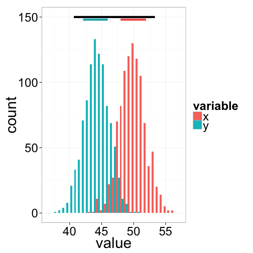
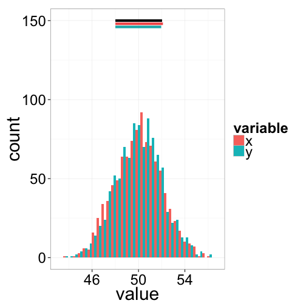
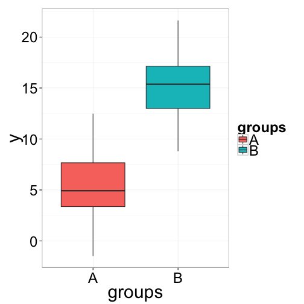
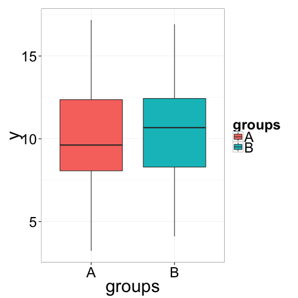
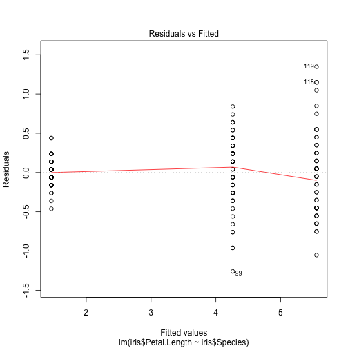
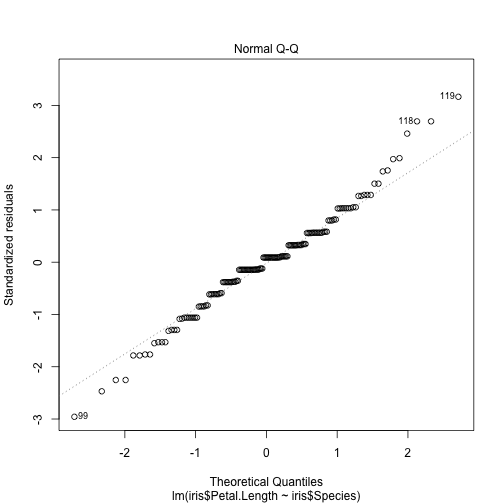
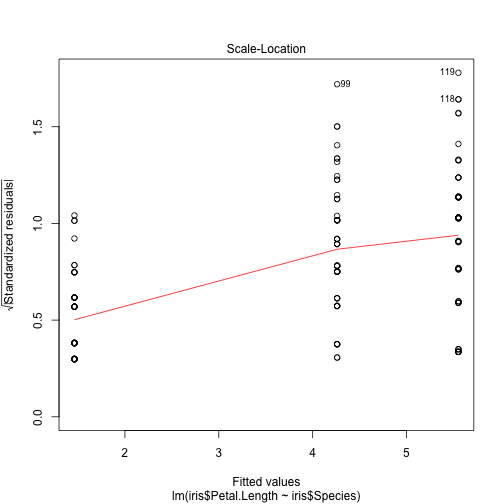
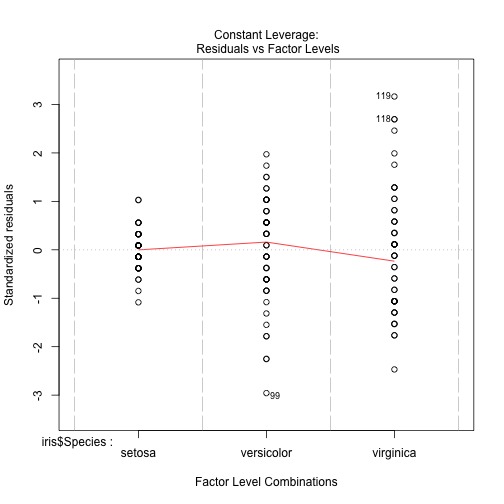
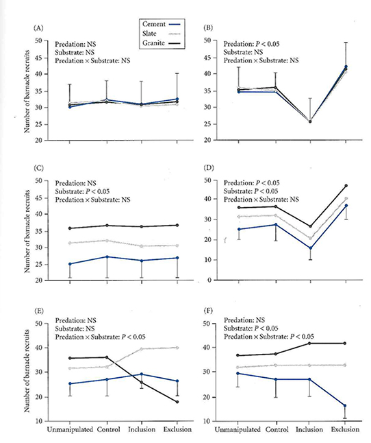
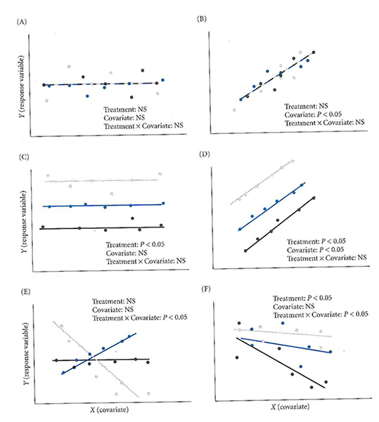

ANOVA
========================================================
incremental:true


Basic Goal of ANOVA
==================

Compare the means of groups that have been sampled randomly, to test whether or not they differ.

The different levels of the categorical variable representing different groups are called **treatments**.

Each observation is called a **replicate** and is assumed to be independent from all other replicates.

So how do we compare group means?  

**Confusingly, it's all about variances (hence ANOVA).**

Intuitive Picture of ANOVA
=====================
incremental:false

 

Black bars at top represent variances ignoring groups.

***
 

Colored bars at top represent variances within groups.

The ANOVA linear model
================
$$Y_{ij}=\mu + A_i + \epsilon_{ij}$$

* $\mu$ is the population grand mean ($\bar{Y_{ij}}$ an unbiased estimator of $\mu$)
*  $A_i$ is the additive linear effect compared to the grand mean for a given treatment $i$ ($A_i$‘s sum to 0). 
*  $\epsilon_{ij}$ is the error variance (the variance of individual points around their treatment group means. These are assumed to be distributed as $N(0,\sigma^2)$).

ANOVA linear model - Simulation
============================

$$Y_{ij}=\mu + A_i + \epsilon_{ij}$$

Let's see how changing model parameters affects the y variable.  We will start a few variables that will be kept constant. 


```r
grandMean <- 10
groups <- rep(c("A", "B"), 100)
myError <- rnorm(200, mean = 0, sd=3)
```

ANOVA linear model - Simulation
===================
incremental:false


```r
y <- grandMean + c(-5, 5) + myError
qplot(groups, y, geom="boxplot", fill=groups)
```

 

ANOVA linear model - Simulation
===================
incremental:false


```r
y <- grandMean + c(-0.3, 0.3) + myError
qplot(groups, y, geom="boxplot", fill=groups)
```

 

The steps in a one-way ANOVA
==============
1.  Calculate the Total SS
2.  Calculate the Within-group SS
3.  Calculate the Between-group SS
4.  Calculate Mean Squares using appropriate df.
5.  Calculate the F ratio 
6.  Calculate the p-value

## As you could tell from your reading, calculating the appropriate sum of squares is complicated, and depends on your experimental design.  Be careful (or just use Monte Carlo)!

Walking through the ANOVA
===========

## Example data from Gotelli Table 10.1


```
  unmanipulated control treatment
1            10       9        12
2            12      11        13
3            12      11        15
4            13      12        16
```

## Who can do this on the board??

Walking through the ANOVA
===========


Source | degrees freedom | SS | Mean Square (MS) | Expected Mean Square | F-ratio
----|----|----|----|----|----|----
Among groups|a-1|$\sum\limits_{i=1}^a\sum\limits_{j=1}^n(\bar{Y}_i - \bar{Y})^2$|$\frac{SS_{among_groups}}{(a-1)}$|$\sigma^2 + n\sigma^2_A$|$\frac{MS_{among}}{MS_{within}}$
within groups (residual) |a(n-1)|$\sum\limits_{i=1}^a\sum\limits_{j=1}^n(Y_{ij} - \bar{Y}_i)^2$|$\frac{SS_{within}}{a(n-1)}$|$\sigma^2$
Total|an-1|$\sum\limits_{i=1}^a\sum\limits_{j=1}^n(Y_{ij} - \bar{Y})^2$|$\frac{SS_{total}}{(an-1)}$|$\sigma^2_Y$

Assumptions of ANOVA
=================

1.  The samples are independent and identically distributed
2.  The residuals $\epsilon_i$ are normally distributed
3.  Within-group variances are similar across all groups (‘homoscedastic”)
4.  Observations are properly categorized in groups

## Supporting assumptions

1. Main effects are additive (no strong interactions). 
2. Balanced design (equal number of observations in all groups). If you are going to do a lot of ANOVA, you need to read about the [ANOVA controversy in R](http://goanna.cs.rmit.edu.au/~fscholer/anova.php) and other models for calculating SS that are more appropriate for unbalanced designs.


ANOVA in R
==============
## Do the analysis

```
myMod <- lm(iris$Petal.Length~iris$Species)
summary(myMod)
anova(myMod)
```

## Try it yourself!

ANOVA in R
==============

## Checking assumptions


```r
#Homogeneity of variances
bartlett.test(iris$Petal.Length ~ iris$Species)
```

```

	Bartlett test of homogeneity of variances

data:  iris$Petal.Length by iris$Species
Bartlett's K-squared = 55.4225, df = 2, p-value = 9.229e-13
```

ANOVA in R
==============
incremental:false

## Checking assumptions


```r
plot(lm(iris$Petal.Length ~ iris$Species))
```

    


Two-Way ANOVA
==========

Life gets more complicated when we are considering more than one factor

$$Y_{ij}=\mu + A_i + B_j + AB_{ij} + \epsilon_{ij}$$

With more than one factor, we have the possibility of non-additive effects of one factor on the other.  These are called **interaction terms**

Two-Way ANOVA in R
==========

## Simple model (no interaction)

```
data(warpbreaks)
anova(lm(warpbreaks$breaks ~ warpbreaks$tension + warpbreaks$wool))
```

## More complex model (with interaction)

```{}
anova(lm(warpbreaks$breaks ~ warpbreaks$tension * warpbreaks$wool))
```

Two-Way ANOVA in R - Order Matters
==========
type:alert

## If your ANOVA is unbalanced (different sample sizes in differnt groups), then the order in which you specify the factors matters!

```
anova(lm(response ~ pred1 * pred2))
```

## Is not the same as

```
anova(lm(response ~ pred2 * pred1))
```

## This is only true is the sample sizes differ. 

### This behavior differs from all other stats packages. You can read more about the [ANOVA controversy in R](http://goanna.cs.rmit.edu.au/~fscholer/anova.php).  You can use the `car` package to compute ANOVA in the same way as SPSS or other packages

Interpreting ANOVA interactions
==============




ANCOVA
============
incremental: false

ANOVA with a continuous covariate

It's a hybrid of regression and ANOVA

Think of it as doing an ANOVA on the residuals of a regression

$$Y_{ij}=\mu + A_i + \beta_i(X_{ij} - \bar{X_i}) + \epsilon_{ij}$$

ANCOVA in R
============

Using baboons data


```r
baboons <- read.table("http://hompal-stats.wabarr.com/datasets/baboons.txt", header=T)
head(baboons)
```

```
     BM SEX  FHD
1  8.62   F 19.9
2  9.07   F 17.9
3  9.98   F 18.9
4 10.43   F 18.8
5 10.89   F 20.3
6 11.34   F 19.5
```

ANCOVA in R
============

## Just add in the covariate


```r
anova(lm(baboons$FHD ~ baboons$SEX + baboons$BM))
```

```
Analysis of Variance Table

Response: baboons$FHD
            Df  Sum Sq Mean Sq  F value    Pr(>F)    
baboons$SEX  1 106.475 106.475 183.6495 3.719e-12 ***
baboons$BM   1   2.833   2.833   4.8859   0.03778 *  
Residuals   22  12.755   0.580                       
---
Signif. codes:  0 '***' 0.001 '**' 0.01 '*' 0.05 '.' 0.1 ' ' 1
```

Interpreting ANCOVA
===============

