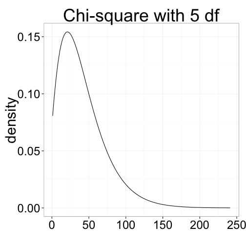
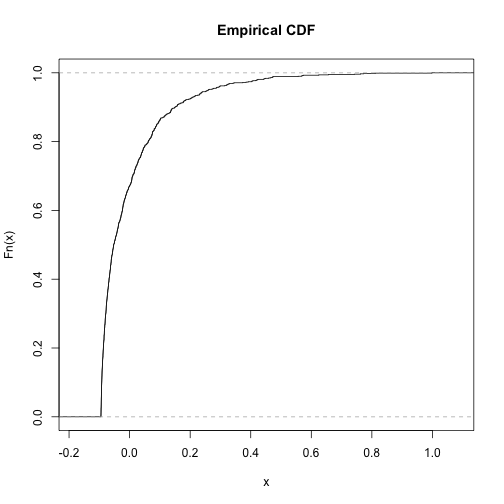
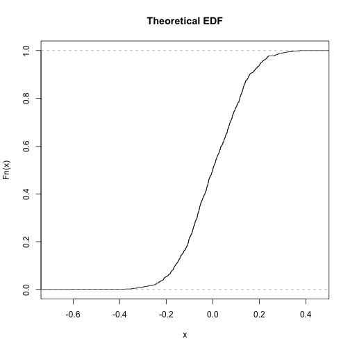

========================================================
incremental: true


Categorical Data
===============

Data that falls into a discrete number of categories. 

The different possible values of a categorical variable are called **levels**


```r
bird_sightings <- 
  factor(c("pigeon", "pigeon", "goshawk", 
           "eagle", "goshawk"))
levels(bird_sightings)
```

```
[1] "eagle"   "goshawk" "pigeon" 
```

Example - Species Occurrences
================


```r
myData <- data.frame(
  site = sample(c("site1","site2"), 1000, replace=T),
  species = sample(c("species1","species2", "species3"),1000, replace=T)
  )
head(myData)
```

```
   site  species
1 site2 species1
2 site1 species1
3 site2 species1
4 site1 species1
5 site1 species1
6 site1 species1
```

Example - Species Occurrences
==============

R has useful tools for counting occurrences


```r
table(myData$site,myData$species)
```

```
       
        species1 species2 species3
  site1      163      159      158
  site2      184      168      168
```

This is called a **contingency table**. Analysis of categorical data always operates on contingency tables.

Contingency Tables
================

A more real (but still fake) example.

Site | *A. afarensis* | *Ar. ramidus* |  *Aepyceros melampus*
---|----|-----|-------
Hadar | 120 | 0 | 600
Aramis | 0 | 90 | 220

Made up of counts or **frequencies** of observations in each category.

Rows are indexed by $i$ and columns are indexed by $j$.

There are $n$ rows in a table and $m$ columns.

Analyzing contingency tables requires the raw counts: not percentages, proportions, etc.

Hypothesis Testing
================
  
Site | *A. afarensis* | *Ar. ramidus* |  *Aepyceros melampus*
---|----|-----|-------
Hadar | 120 | 0 | 600
Aramis | 0 | 90 | 220


**Null hypothesis**: no association between $site$ variable and the $species$ variable.

**Alternative hypothesis**: There is a relationship between the $site$ variable and the $species$ variable

To reject the null hypothesis, we need to ask, what are the **expected values** of the cells, assuming no association?

Hypothesis Testing - Expected Values
================

Intuitively, what would you expect the value of each cell to be assuming the row and column variable are unrelated???

Site | *A. afarensis* | *Ar. ramidus* |  *Aepyceros melampus* 
---|----|-----|-------
Hadar | 120 | 0 | 600
Aramis | 0 | 90 | 220 

Going back to probability, the probability of being an *A. afarensis* at Hadar is a **shared event** made up of two **simple events**:

*  being *A. afarensis*
*  being at Hadar

We simply multiply these probabilities.

Hypothesis Testing - Expected Values
================
Site | *A. afarensis* | *Ar. ramidus* |  *Aepyceros melampus* 
---|----|-----|-------
Hadar | 120 | 0 | 600
Aramis | 0 | 90 | 220 

Shortcut for computing expected cell frequencies:

$$\hat{Y}_{i,j} = \frac{{row\ total}\times{column\ total}}{sample\ size} = \frac{\sum\limits_{j=1}^mY_{i,j}\times\sum\limits_{i=1}^nY_{i,j}}{N}$$

**Volunteer:** calculate by hand on board!

Hypothesis Testing - Chi-Square
===========

Karl Pearson came up with a test statistic to quantify how much the counts differ from the expected values:

$$X^2_{Pearson} = \sum\limits_{all\ cells}\frac{(Observed-Expected)^2}{Expected}$$

This is analogous to the residual sum of squares in linear modeling.

Hypothesis Testing - Chi-Square
=============
left:65

 

***

Chi-square has a known distribution

Can be used to calculate p-values

Chi-square in R
=========


```r
myTable <- table(myData$site,myData$species)
chisq.test(myTable)
```

```

	Pearson's Chi-squared test

data:  myTable
X-squared = 0.2257, df = 2, p-value = 0.8933
```


Fisher's Exact Test
=============

More appropriate when sample sizes are low.

General rule is to use Fisher's if expected value for any cell is < 5.


```r
fisher.test(myTable)
```

```

	Fisher's Exact Test for Count Data

data:  myTable
p-value = 0.8966
alternative hypothesis: two.sided
```

Goodness of Fit Tests
===============

These test how closely observed data fit some underlying distribution (e.g., binomial, uniform, normal)

For discrete cases, chi-square can be used as a goodness of fit statistic.  

Chi-square goodness of fit
============

For instance:  say we counted the frequency of a *A. afarensis* in 4 different geological strata through time. 


```r
afarensis <- c(24, 32, 19, 36)
```


Chi-square goodness of fit
============

We can use chi-square to test how well this fits a uniform distribution:


```r
chisq.test(afarensis)
```

```

	Chi-squared test for given probabilities

data:  afarensis
X-squared = 6.3694, df = 3, p-value = 0.09496
```

Chi-square goodness of fit
============

We could specify some other distribution by passing a vector of probabilities.


```r
chisq.test(afarensis, p=c(.4, .1, .1, .4))
```

```

	Chi-squared test for given probabilities

data:  afarensis
X-squared = 55.9369, df = 3, p-value = 4.333e-12
```

Continuous Goodness of Fit - KS
============

The **Kolmogorov-Smirnov** is a commonly used goodness of fit test for continuous data.

The KS test compares the cumulative distribution function (CDF) of a set of observed data to a theoretical distribution.

KS-Test
========
incremental:false

 

*** 

 

KS-Test
=========
The single largest deviation of the empirical from the theoretical is the KS statistic. This is used to compute a p-value.

Can be used for any distribution, not just the normal distribution.

KS-Test in R
=========

```r
ks.test(rnorm(100), "pnorm")
```

```

	One-sample Kolmogorov-Smirnov test

data:  rnorm(100)
D = 0.1643, p-value = 0.009071
alternative hypothesis: two-sided
```

KS-Test in R
=========

```r
ks.test(rnorm(100)^2, "pnorm")
```

```

	One-sample Kolmogorov-Smirnov test

data:  rnorm(100)^2
D = 0.5002, p-value < 2.2e-16
alternative hypothesis: two-sided
```
