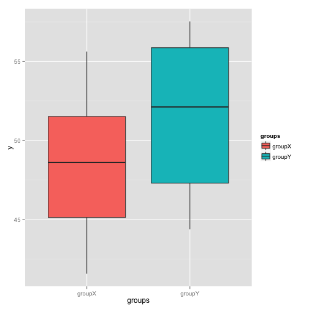

Power Analysis
========================================================
incremental:true


Power Analysis
==================
## Allows you to ask:


### How big of a sample do I need to detect a given effect size with a given level of confidence.


Steps in a power analysis
====================

*  decide on parameters for effect size, error magnitude
*  decide how much power you want
*  write a function to simulate data with your effect size, error magnitude, sample size
*  write a for loop to increase sample size until desired power is achieved


Type of errors - Redux
====================

The Truth | Retain $H_0$ | Reject $H_0$
---------|----------------|---------
$H_0$ True | Correct! | Type I error ($\alpha$)
$H_0$ False | Type II error ($\beta$)| Correct!

In a power analysis, $H_0$ is in fact false.

Any non-significant p values are Type II errors.  

In a given bunch of simulations, **power** = $1 - \beta$

A common target is a power of 0.8

Remember, this is a balancing act!  The more powerful, the more chance of commiting Type I error, because Type I and Type II are inversely related.

Your homework sets you up to do power analysis for ANOVA!
===================

```r
doANOVA <- function(sampleSize=20, grandMean=50, errorSD=5, meanDiff=3) {
  library(ggplot2)
  myError <- rnorm(sampleSize, mean = 0, sd = errorSD)
  groups <- rep(c("groupX", "groupY"), sampleSize/2)
  y <- grandMean + c((meanDiff/2)*-1, (meanDiff/2)) + myError
  print(qplot(x=groups, y=y, geom="boxplot", fill=groups))
  myModel <- lm(y~groups)
  return(pf(summary(myModel)$fstatistic[1],summary(myModel)$fstatistic[2],summary(myModel)$fstatistic[3], lower.tail = FALSE))
}
```

Your homework sets you up for this!
==============
incremental:false


```r
doANOVA(sampleSize=20, errorSD=5, meanDiff=3)
```

 

```
    value 
0.1553212 
```

Calculate power for a given sample size
==========================


```r
calculatePower <- function(n){
  results<-numeric(500)
  for(i in 1:500){
    results[i] <- doANOVA(sampleSize=n, errorSD=5, meanDiff=3)
  }
  beta <- sum(results>0.05) / length(results)
  paste("power = ", 1 - beta)
  return(1 - beta)
}
calculatePower(n=20)
```

```
[1] 0.252
```
 
Another loop to find n with power >= 0.8
===============


```r
currentPower <- 0
sampleSize <- 20

while(currentPower < 0.8){
  currentPower <- calculatePower(n=sampleSize)
  sampleSize <- sampleSize + 4
}
currentPower
```

```
[1] 0.814
```

```r
sampleSize
```

```
[1] 96
```
