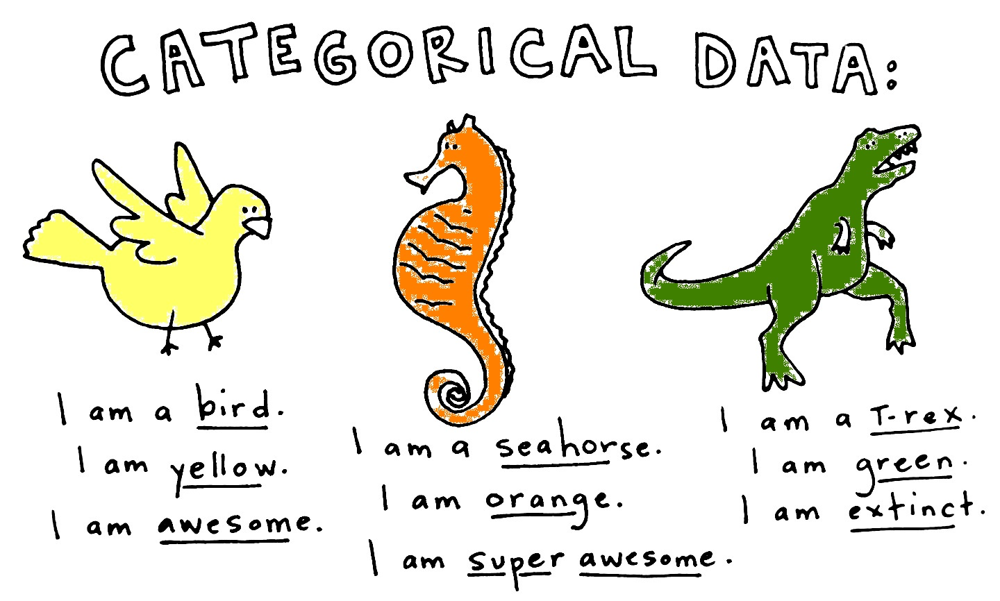

========================================================
incremental: true



Categorical Data
===============

Data that falls into a discrete number of categories. 

The different possible values of a categorical variable are called **levels**


```r
bird_sightings <- 
  factor(c("pigeon", "pigeon", "goshawk", 
           "eagle", "goshawk"))
levels(bird_sightings)
```

```
[1] "eagle"   "goshawk" "pigeon" 
```

Contingency Tables
================

Site | *A. afarensis* | *Ar. ramidus* |  *Aepyceros melampus*
---|----|-----|-------
Hadar | 120 | 0 | 600
Aramis | 0 | 90 | 220

Made up of counts or **frequencies** of observations in each category.

Rows are indexed by $i$ and columns are indexed by $j$.

There are $n$ rows in a table and $m$ columns.

Analyzing contingency tables requires the raw counts: not percentages, proportions, etc.

Hypothesis Testing
================
  
Site | *A. afarensis* | *Ar. ramidus* |  *Aepyceros melampus*
---|----|-----|-------
Hadar | 120 | 0 | 600
Aramis | 0 | 90 | 220


**Null hypothesis**: no association between $site$ variable and the $species$ variable.

**Alternative hypothesis**: There is a relationship between the $site$ variable and the $species$ variable

To reject the null hypothesis, we need to ask, what are the **expected values** of the cells, assuming no association?

Hypothesis Testing - Expected Values
================
Site | *A. afarensis* | *Ar. ramidus* |  *Aepyceros melampus* 
---|----|-----|-------
Hadar | 120 | 0 | 600
Aramis | 0 | 90 | 220 

The expected value for each cell is computed as:

$$\hat{Y}_{i,j} = \frac{{row\ total}\times{column\ total}}{sample\ size} = \frac{\sum\limits_{j=1}^mY_{i,j}\times\sum\limits_{i=1}^nY_{i,j}}{N}$$

**Challenge:** calculate by hand on board

Hypothesis Testing - Chi-Square
===========

$$X^2_{Pearson} = \sum\limits_{all\ cells}\frac{(Observed-Expected)^2}{Expected}$$
