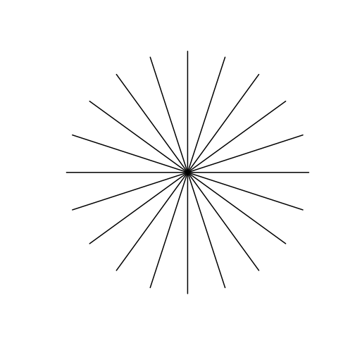
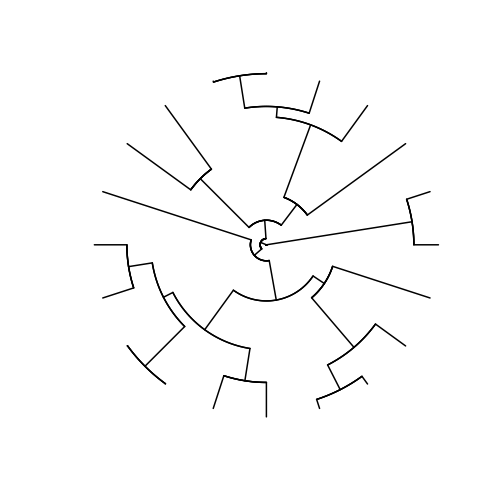
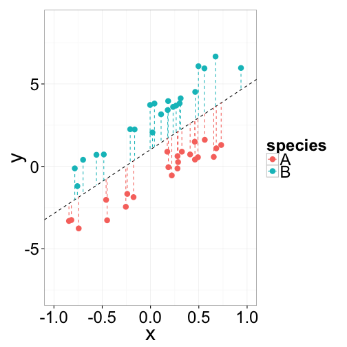
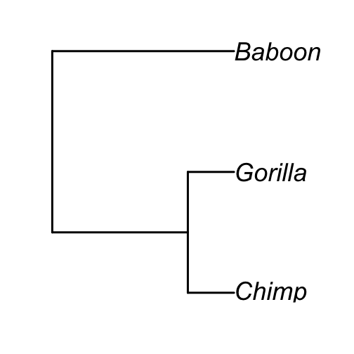

Phylogenetic Signal
========================================================
incremental:true

========================================================

# Question

## What is the #1 assumption we have made in parametric stats throughout the semester?
   
# Answer

## Each observation is independent, and therefore residuals are independent and (hopefully) normally distributed

The Problem - Graphically
===============
incremental:false

### statistics assumes

 

***

### evolution provides

 

The Problem - Graphically
==========
left:60

 

***

### Regression assumes that residuals are independent

### However, sometimes we can predict the sign of the residual (+ or -) by knowing the phylogeny

### This is called ***phylogenetic autocorrelation*** and causes problems

The Problem is Insidious
===================
left:40

 

***

### This example is extreme...some people call this a  ***grade shift***

### Folks have long been wary of grade shifts, and done seperate regressions for different groups

### But in absence of obvious grade shifts, phylogenetic autocorrelation of residuals still causes 2 problems:

*  increases variance of parameter estimates (e.g. slopes and intercepts)
*  increases Type I (false positive) error rate

Recall the General Linear Model 
=================

$$Y_i = \beta_0 + \beta_1X_i + \beta_2X_i +\ ... +\ \beta_nX_i  + \epsilon_i$$

### where: 

* $\beta_0$ is the y-intercept (value of y where x= 0)
*  $\beta_1X_i$ is the slope value for the 1st x variable
*  $\epsilon_i$ is the error term, distributed as a normal random variable

### The solution to the problem of phylogenetic autocorrelation comes when we relax our assumptions about the error term

Generalized Linear Model
=================

### Similar in structure to general linear models, but allows specification of the assumed residual error structure

### With biological data, a reasonable assumption is that residuals will be correlated with phylogenetic distance (sum of branch lengths along the phylogenetic tree)

Phylogenetic Generalized Linear Model
============

 

*** 

### baboon is about 6 times as far from the chimp as the gorilla and chimp are from one another

### We can represent all these distances by making a phylogenetic ***variance/covariance matrix***

### We use this phyloVCV matrix in pGLM, instead of a normal error term

### Often called PGLS, but pGLM is more general term

