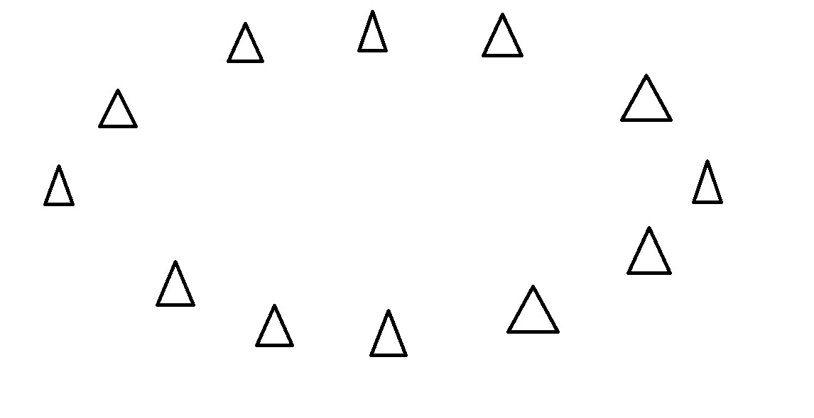
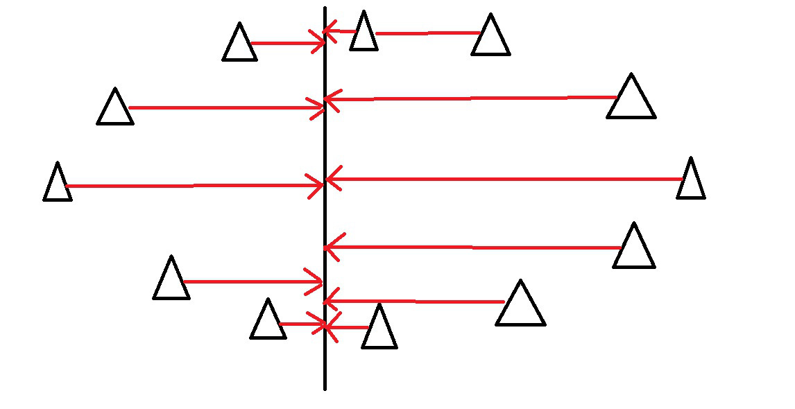
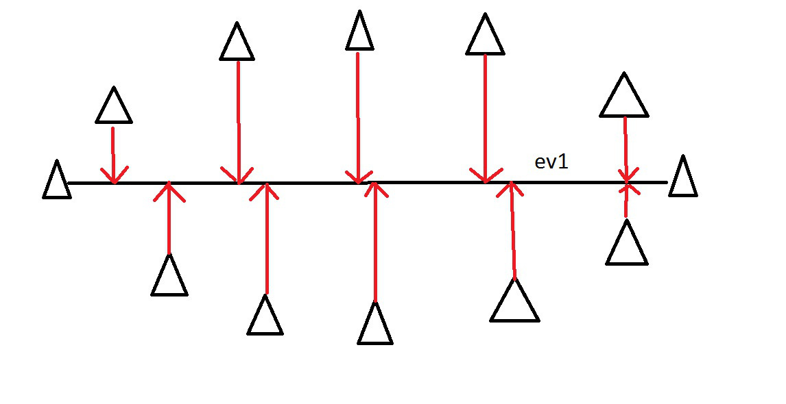
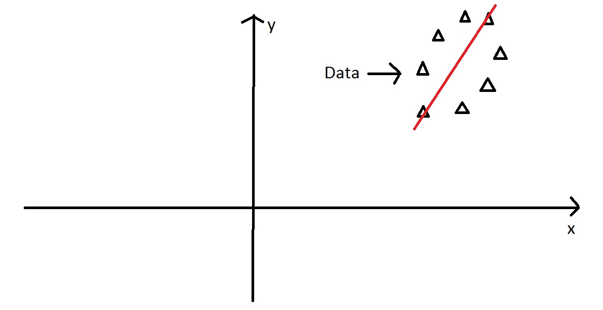
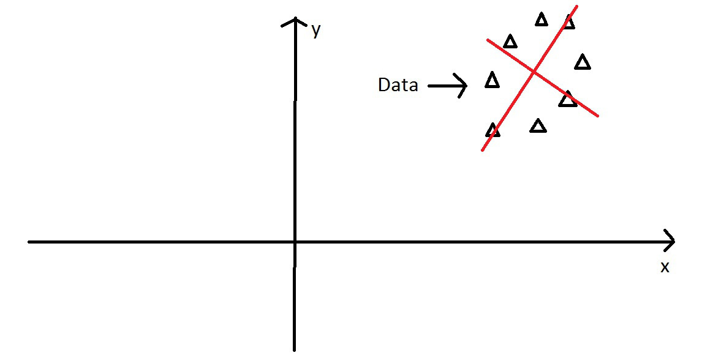

## Multivariate Stats II 


## Principal Components Analysis {.build}

Like DFA, PCA is an ordination technique

Goal is to "summarize" variation in multivariate data

Reduce the number of dimensions needed to describe most of the variance

## PCA - Intuitively 

Start with some data points



## PCA - Intuitively 

Examine the variance of the points along some axis...




## PCA - Intuitively 


This axis covers much more variance in our points...




## PCA - Intuitively 

Imagine these points in some XY coordinate system....


## PCA - Intuitively 

We can still find the axis of maximum variation....



## PCA - Intuitively 

Then we find the orthogonal axis, 90$^\circ$ from major axis



## PCA - Intuitively 

Next, we rotate the data to use the two new principal components axes we found...


## PCA - operationally {.build}

> *  Starting with the covariance matrix
> *  The eigenvalues of this matrix are the variances explained by each PC
> *  The eigenvectors of this matrix are the contributions of each original variable to the PC
> *  The eigenvectors can be thought of as "transformation equations" to convert a datapoint from the original space to the PC space

## PCA - more details {.build}


> *  We start with $p$ variables for $n$ individuals
> *  The first PC is the linear combination of all the variables:
> *  $PC1 = a_1X_1 + a_2X_2 + ... + a_pX_p$
> *  PC1 is chosen to vary as much as possible for all the individuals, subject to the condition that the sum of the squared $a$ terms is 1
> *  Subsequent PCs are uncorrelated with the prior PCs

## PCA - even more details {.build}


> 1.  (sometimes) **scale** and **center** your variables to have a mean of 0 and variance of 1.
> 2.  Calculate the covariance matrix (this will be a correlation matrix if you did step 1)
> 3.  Find the eigenvalues (variances of the PCs) and corresponding eigenvectors (the loadings for each variable) for the covariance/correlation matrix
> 4.  Ignore the components that (hopefully) explain very little variance, and focus on the first few components

## Principal Components Analysis in R {.build}

There are 2 functions in R

> *  `prcomp()` 
> *  `princomp()`

These differ in their implementation and default arguments, but provide similar results. 

However, `prcomp()` is preferred for numerical accuracy

## PCA - Learn by Example 

```{r echo=FALSE, fig.width=10}
library(ggplot2)
library(gridExtra)
theme_set(theme_bw(15))
sepal<-qplot(Sepal.Length, Sepal.Width, data=iris, color=Species, main="Iris Sepal", size=I(6))
petal<-qplot(Petal.Length, Petal.Width, data=iris, color=Species, main="Iris Petal", size=I(6))
grid.arrange(sepal, petal, nrow=1)
```

## PCA - Learn by Example {.smaller}


```{r}
irisPCA <- prcomp(iris[,1:4], 
                  scale=TRUE, center=TRUE)
irisPCA
summary(irisPCA)
```

## PCA - Learn by Example {.smaller}


```{r echo=TRUE, fig.width=10}
qplot(irisPCA$x[,1], 
      irisPCA$x[,2], 
      xlab="PC1", ylab="PC2", main="Iris PCA", color=iris$Species, size=I(6))
```


## Correspondence Analysis {.build}


> *  A method for visualizing a 2-way contingency table
> *  The goal is to have rows (often taxa) and colums (often sites) appear in same ordination plot
> *  Often called ***reciprocal averaging***
> *  Site scores are weighted averages of species values, and species scores are a weighted > average of site values
> *  useful for count data and presence/absence

## Correspondence Analysis {.smaller}

```{r}
bovids <- read.table("http://hompal-stats.wabarr.com/datasets/bovid_occurrences.txt", header=TRUE, sep="\t")
library(tidyr)
bovids <- spread(bovids, key=site, value=count)
row.names(bovids) <- bovids$taxon
bovids<-bovids[,2:9]
head(bovids)
```

## Correspondence Analysis {.smaller}

* `ca` package in R
*  Row points (red) appear close to rows with similar column values
*  Column points (blue) appear close to columns with similar row values

```{r echo=FALSE, fig.width=10, fig.height=4}
library("ca")
myCA <- ca(bovids)
qplot(x=myCA$rowcoord[,1], myCA$rowcoord[,2], label=rownames(myCA$rowcoord), size=I(8), geom="text", color=I("blue")) + 
  geom_text(aes(x=myCA$colcoord[,1], y=myCA$colcoord[,2]), label=rownames(myCA$colcoord), size=8, color="red") + 
  labs(x="Dimension 1", y="Dimension 2", title="Corresponce Analysis - Bovid Abundances") + 
  scale_x_continuous(limits=c(-2, 2))

```

## Correspondence Analysis {.smaller}

Code to do CA and make plot on previous page

```{r results="hide", fig.keep="none"}
library("ca")
myCA <- ca(bovids)
qplot(x=myCA$rowcoord[,1], 
      y=myCA$rowcoord[,2], 
      label=rownames(myCA$rowcoord), 
      size=I(8), 
      geom="text", 
      color=I("blue")) + 
  geom_text(aes(x=myCA$colcoord[,1], 
                y=myCA$colcoord[,2]), 
                label=rownames(myCA$colcoord), 
                size=8, 
                color="red") + 
  labs(x="Dimension 1", y="Dimension 2", title="Corresponce Analysis - Bovid Abundances") + 
  scale_x_continuous(limits=c(-2, 2))

```