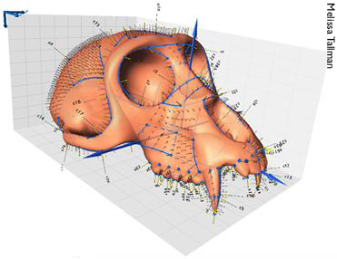

## Multivariate Stats III 


## Geometric Morphometrics (GM) 




involves the analysis of Cartesian geometric coordinates rather than length, area, volume measurements

## Steps in a GM analysis {.build}

using the `geomorph` package in R

> 1.  Get coordinate data (e.g., digitize outline from a photo, use a microscribe, get 3D coordinates from laser scanned specimen, etc)
> 2.  Perform a Generalized Procrustes Analysis (GPA)
> 3.  Analyze and visualze the results from the GPA

## GM - Step 1 - Coordinates {.build}


> *  involves capturing homologous ***landmarks*** or ***semi-landmarks***
> *  can be 2D or 3D
> *  each specimen will have a unique ***configuration*** of landmarks in its own coordinate system

## GM - Step 1 - Coordinates {.build .smaller}

We will use 2D coordinate data of salamander head shape

note that the landmark data is in a $p \times k \times n$ array

```{r message=F}
library(geomorph)
data(plethodon)
str(plethodon$land)
```

## GM - Step 2 - Procrustes 


## GM - Step 2 - Procrustes {.build}

> * Translates all configurations to the origin
> * scales them to centroid size
> * rotates them until the ***Procrustes distance*** between configurations is minimized


## GM - Step 2 - Procrustes {.build .smaller}


```{r results='hide'}
GPA_pleth <- gpagen(plethodon$land)
```


```{r}
GPA_pleth
```

## GM - Step 3 - Analyze and Visualize 


```{r}
gp <- as.factor(paste(plethodon$species, plethodon$site)) 
PCA <- plotTangentSpace(GPA_pleth$coords, groups = gp)
```

## GM - Step 3 - Analyze and Visualize {.build}

you can do TONS of analyses using the functions in the `geomorph` package

Questions?

## Non-Metric Multidimensional Scaling {.build}

designed to create a diagram of relationships between objects

based on the distance matrix

## Non-Metric Multidimensional Scaling {.build}

### Steps in the analysis

>*  generate a distance matrix (often euclidian) $D$.  Each element $D_{ij}$ is the euclidian distance between the $ith$ and $jth$ observation.
>*  choose the number of dimensions $n$ to use
>*  start by placing the $m$ observations in an initial configuration in $n$ dimensional space
>*  compute new distances: $\delta_{ij}$ for the points in the initial configuration
>*  do a regression of $\delta_{ij}$ on $d_{ij}$, and use this regression to produce a set of expected distance values $\hat{\delta}_{ij}$

## Non-Metric Multidimensional Scaling 


## Steps in the analysis {.build}

> *  compute a goodness of fit between $\delta_{ij}$ and $\hat{\delta}_{ij}$.  This is the current **stress** of the configuration $$ Stress = \sqrt{\frac{\sum\limits_{i=1}^m\sum\limits_{j=1}^n(\delta_{ij}-\hat{\delta}_{ij})^2}{\sum\limits_{i=1}^m\sum\limits_{j=1}^n\hat{\delta}_{ij}}}$$
> *  note that stress looks an awful lot like the chi-square statistic
> *  change the position of the observations a little to reduce the stress, and rinse and repeat until the stress cannot be reduced any more

## The vegan package {.build}


Widely used for community ecology

has some useful ordination functions,  distance metrics, and diversity indices

```{r}
#install.packages('vegan')
library("vegan")
vignette(package="vegan")
```


## vegan - distance {.build}

> *  more options for distance matrices including:  bray, jaccard, gower, raup, mahalanobis, etc

```{r }
data(BCI)
vegdist(BCI, method="jaccard")
```

## vegan - diversity {.build}


> *  `diversity()` calculates common diversity metrics including: shannon-weaver, fischer, simpson, etc

```{r}
diversity(BCI, index = "shannon")
```

## vegan - rarefaction {.build}


> *  species richness increases with sample size, so it is common practice to use ***rarefaction*** to resample larger assemblages to a smaller size

```{r}
rarefy(BCI, min(rowSums(BCI)))[1:5]
```

## vegan - rarefaction {.build}


```{r}
rarecurve(BCI[1,], step = 4)
```

## vegan - ordination {.build}


> *  Detrended correspondence analysis

```{r}
plot(decorana(BCI))
```

## vegan - ordination {.build}

> *  Non-metric multidimensional scaling

```{r cache=TRUE}
result <- plot(metaMDS(BCI, k=3))
```

## vegan - ordination {.build}
> *  Non-metric multidimensional scaling

```{r}
ordiplot(result)
```