Comparative Methods
========================================================
incremental:true 

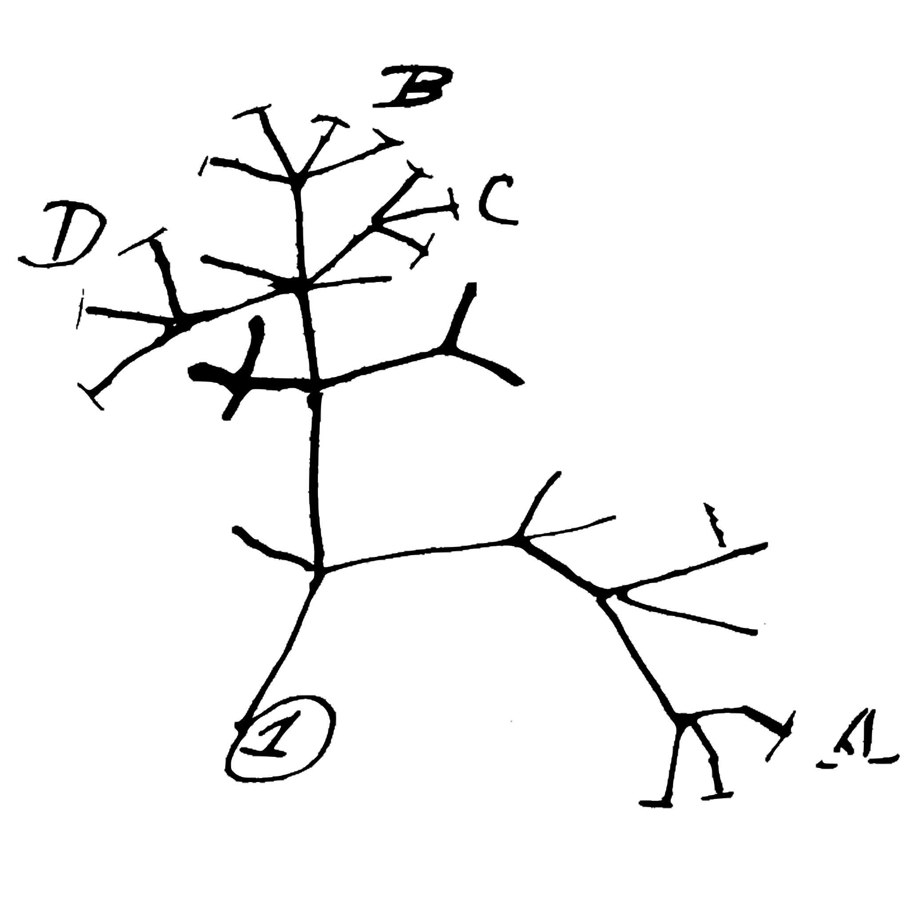

Anatomy of a phylogenetic tree
================ 

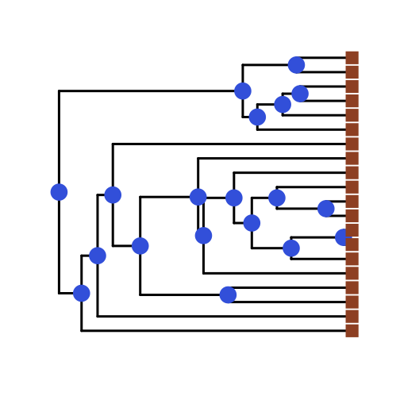

***

***nodes*** are the blue circles

***tips*** are the brown squares

***edges*** connect nodes (and tips)

edges have a length (known as a ***branch length***)

trees are ***hierarchical***, the pattern of branching is the ***topology***, and the deepest node is the ***root node***

Same topology, different representation
=====================

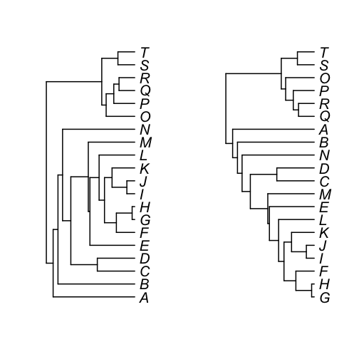

***

The topology represents a series of hierarchical branching events

These trees have identical topologies.

***The differences between these trees are purely aesthetic***

Same topology, different representation
========================
incremental:false

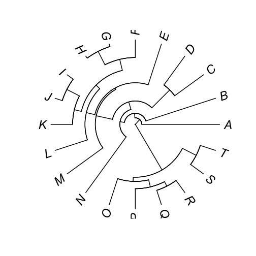

***

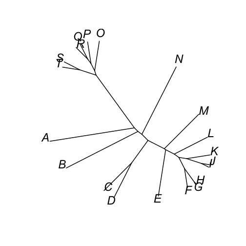

Phylogenetic Trees in R
========================

The `ape` package provides functions for interacting with phylogenetic trees.

The most common file format for phylogenetic trees is the Newick format (which is incorporated in the Nexus format).


```r
textTree <- "(Gibbon:1.6, (Gorilla:1, (Chimp:0.2, Human:0.2):0.8):0.6);"
```

Phylogenetic Trees in R
===============
incremental:false
left:55

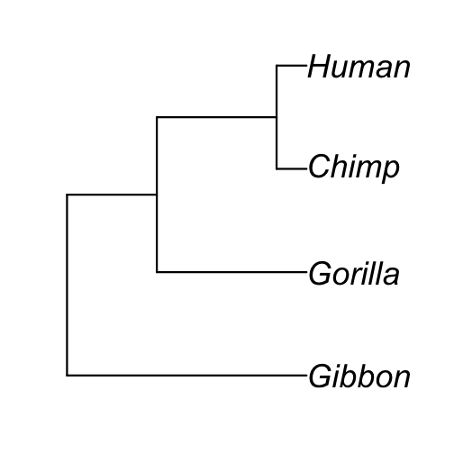

*** 

Trees in Newick format can be read with `read.tree()`


```r
plot(read.tree(     text=textTree))
```

Trees in Nexus format (e.g. from the program Mesquite) can be read with `read.nexus()` 


Phylogenetic Trees in R
========================

Like most everything, a phylogenetic tree in R is just a special type of list (of class `phylo`)


```r
str(myTree)
```

```
List of 4
 $ edge       : int [1:6, 1:2] 5 5 6 6 7 7 1 6 2 7 ...
 $ Nnode      : int 3
 $ tip.label  : chr [1:4] "Gibbon" "Gorilla" "Chimp" "Human"
 $ edge.length: num [1:6] 1.6 0.6 1 0.8 0.2 0.2
 - attr(*, "class")= chr "phylo"
 - attr(*, "order")= chr "cladewise"
```

Phylogenetic Trees in R
========================
incremental:false

`drop.tip()` - drops named tips from a tree


```r
myTree
```

```

Phylogenetic tree with 4 tips and 3 internal nodes.

Tip labels:
[1] "Gibbon"  "Gorilla" "Chimp"   "Human"  

Rooted; includes branch lengths.
```

Phylogenetic Trees in R
========================
incremental:false

`drop.tip()` - drops named tips from a tree


```r
drop.tip(myTree, c("Chimp", "Human"))
```

```

Phylogenetic tree with 2 tips and 1 internal nodes.

Tip labels:
[1] "Gibbon"  "Gorilla"

Rooted; includes branch lengths.
```

Challenge
==============

Read in [this ruminant phylogeny](http://hompal-stats.wabarr.com/datasets/ruminants.phy) (Hernández Fernández & Vrba, 2007) using the `ape::read.tree()` function.

Drop all tips except the following: `"Alcelaphus_buselaphus", "Sigmoceros_lichtensteinii", "Connochaetes_gnou", "Connochaetes_taurinus", "Beatragus_hunteri", "Damaliscus_lunatus", "Damaliscus_pygargus"`

Hint you can use `drop.tip()` or `extract.clade()` 


Challenge
==============
incremental:false

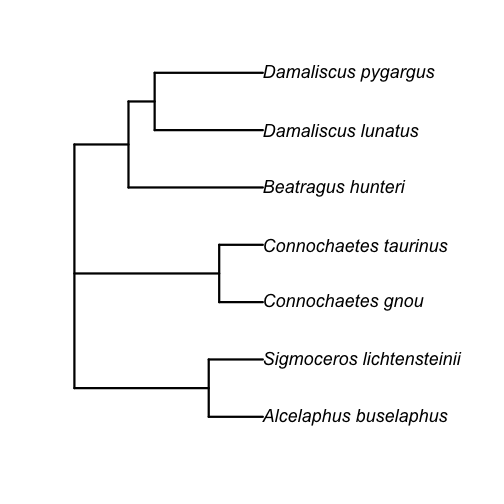

***

Plot the extracted clade of Alcelaphins

Experiment with:

*  `tip.labels()`
*  `node.labels()`
*  graphical parameters
  *  `tip.color`
  *  `edge.color`
  *  `cex` - label size
  *  see `?plot.phylo` for all possible graphics options

=============

# Question


## What is the #1 assumption we have made in parametric stats throughout the semester?


# Answer

## Each observation is independent, and therefore residuals are independent and (hopefully) normally distributed

The Problem - Graphically
===============
incremental:false

### statistics assumes

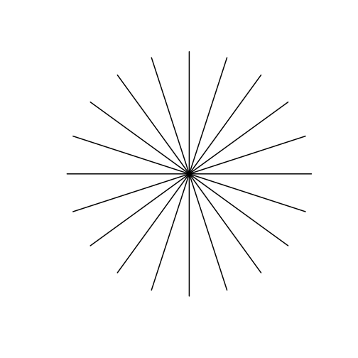

***

### evolution provides

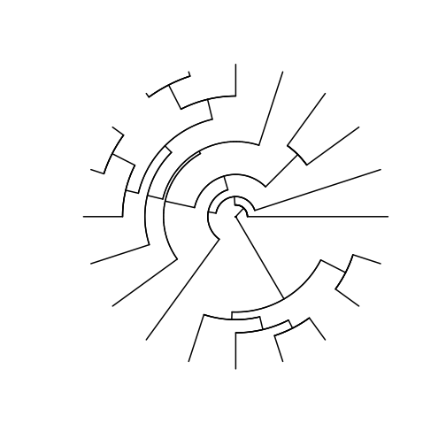


The Problem - Graphically
==========
left:60

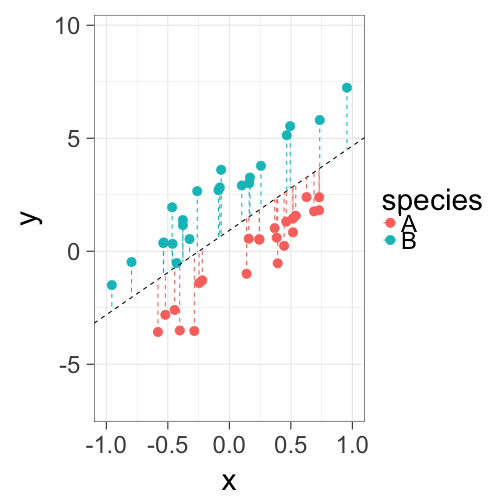

***

Regression assumes that residuals are independent

However, sometimes we can predict the sign ($\pm$) by knowing the phylogeny

This is called ***phylogenetic autocorrelation*** and causes problems

The Problem is Insidious
===================
left:40


***

This example is extreme...some people call this a  ***grade shift***

Folks have long been wary of grade shifts (separate analyses for groups)

Even without obvious grade shifts, phylogenetic autocorrelation of residuals causes 2 problems:

*  increases variance of parameter estimates (e.g. slopes and intercepts)
*  increases Type I (false positive) error rate

Recall the General Linear Model 
=================

$$Y_i = \beta_0 + \beta_1X_i + \beta_2X_i +\ ... +\ \beta_nX_i  + \epsilon_i$$

where: 

* $\beta_0$ is the y-intercept (value of y where x= 0)
*  $\beta_1X_i$ is the slope value for the 1st x variable
*  $\epsilon_i$ is the error term, distributed as a normal random variable

The solution to the problem of phylogenetic autocorrelation is to relax assumptions about the error term.

Generalized Linear Model
=================

Similar in structure to general linear models, but allows specification of the assumed residual error structure

This error structure is represented as an expected variance/covariance matrix 

Requires branch lengths and a particular model of evolution

The most common assumed model of evolution is ***Brownian motion***

Brownian Motion
==================
left:60

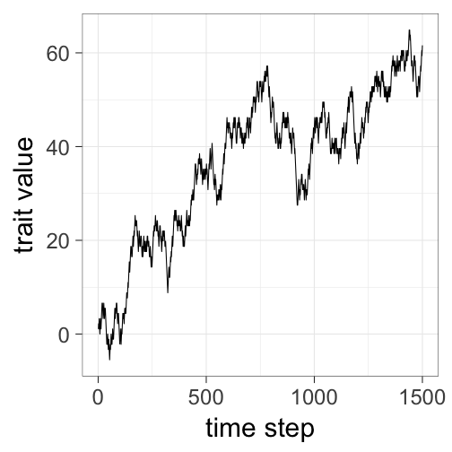
 
***
 
Traits evolve in a random direction at each time step, independent of previous changes

***Assumes no natural selection***

***Assumes constant rate of change***

Brownian motion is assumed in 95%+ of studies you will read

 
Phylogenetic Generalized Linear Model
============

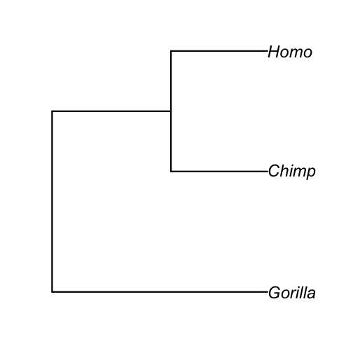

*** 

Homo and chimp have much shorter branches connecting them than chimp and gorilla

Represented as ***variance/covariance matrix*** using functions in `ape`

We use this phyloVCV in pGLM, instead of a normal error term

(Often called PGLS, but pGLM is more general term)


Quantifying Phylogenetic Signal
==============

Residual autocorrelation in proportion to the Brownian VCV is a reasonable starting assumption, but we don't want to always assume this

Better to estimate how much phylogenetic signal exists

***$\lambda$ provides this estimate***

varies between 0 and 1, and scales the branch lengths of the tree (and thus the VCV matrix)

lambda - branch length transformations
===============
incremental:false

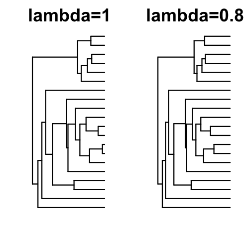

*** 

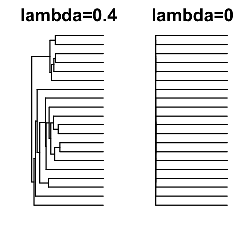

Estimating lambda
=============

when doing PGLS, you can estimate the most appropriate value of lambda for your data

if $\lambda = 0$ then PGLS is equivalent to general linear model (non-phylogenetic)

if $\lambda = 1$ then PGLS is equivalent to phylogenetically independent contrasts (an older way of "correcting" for phylogeny)

PGLS in R
=============

`caper` package is most user friendly

Three steps:

0.  Read in your data and your tree
1.  Use the `comparative.data()` function to match up your tree with your dataframe
2.  Use the `pgls()` function, specifying that lambda should be estimated by maximum likelihood

Example: 

```{}
pgls(response ~ predictor1 + predictor2, data=myCompData, lambda="ML")
```
