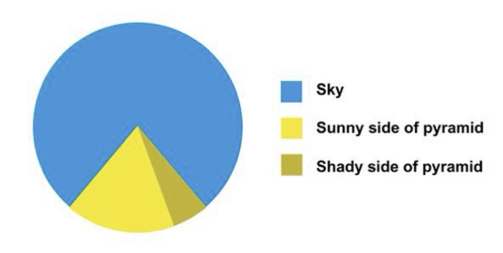
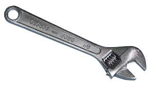
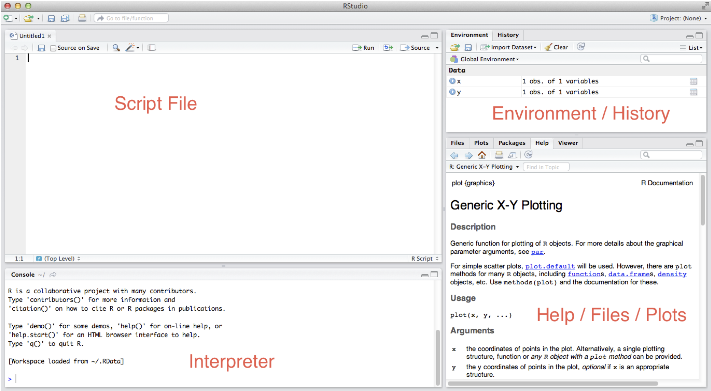

## Welcome to ANTH 6413!

this is the only pie chart you will see all semester.

## Course Goals

- Gain the statistical knowledge to critically evaluate the use of statistics in the literature of bioanthro and related fields. 
- Get hands-on experience implementing analyses with real world data
- Learn practical tools for doing "data-science"

## "Data-science"

**Data science** is an industry buzzword and cliche

From wikipedia:

> "Data science is an interdisciplinary field about **processes and systems**
> to **extract knowledge or insights from data** in various forms, either structured 
> or unstructured, which is a continuation of some of the data analysis fields 
> such as **statistics**, data mining, and predictive analytics."

> - **It is also a big part of what scientists do!**
> - Processes and systems for getting insight from data are important!

## Data science pipeline

## Confession: I believe tools matter, a lot

> - We will spend a lot of time on the "how"
> - You will become very familiar with the nuts-and-bolts of analyzing data
> - Most of your grade comes from practical exercises

## Grading

Assignment                  | Percent
--------------------------------------------------------|---------------
Weekly homework assignments - submitted on Blackboard  | 40%
Practical Exam 1 | 20%
Practical Exam 2 | 20%
Class Project | 20%

## Outcome of the course

When you leave this course, I hope you are empowered to:

> -  collect your data in a format that makes your life easier
> -  explore patterns in your data
> -  test meaningful hypotheses using appropriate statistical tools
> -  communicate these results

## Tools of the Trade

> - MS Excel
> - Commercial Statistics Packages (e.g., SPSS)
> - R – open source and free package for statistical analysis

## Tools of the Trade

- MS Excel
- ~~Commercial Statistics Packages (e.g., SPSS)~~
- R – open source and free package for statistical analysis

## Why do I use R?

> - **Ignorance** - Because I don’t know how to use anything else
> - **Comprehensiveness** – Learn this one tool well, and you can do (almost) ANYTHING
> - **Reproducibility** – an R script is a detailed record of exactly what I did, from the raw data file, through data transformation, to analysis and results.
> - **Popularity** - R is insanely popular in academia and in industry ("why hello there, marketable skills!")

## What is R?

R is an **open-source** language and environment for statistical computing and graphics. 

**open-source** means that anyone can look at the code to see how it works.

## What is R?

The 5th most popular programming language in the world

## What is R?

A rapidly growing system of user contributed packages.

## R Studio

## Course Website

http://hompal-stats.wabarr.com

Let's check out the website then do the Introduction To R

**Note**: First homework assignment is due on September 12. 