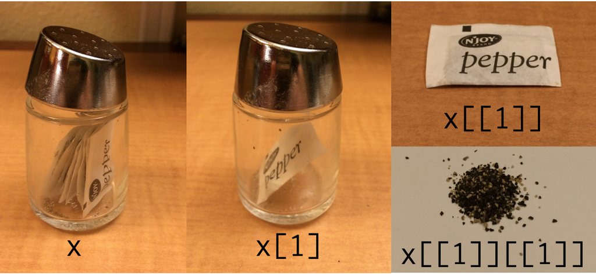

## We didn't get to this topic last week...

Functions that help avoid writing `for()` loops

## The apply() family of functions

These functions are called "functionals" because they take a function as an argument, and apply that function in specified ways

- `apply()` - function applied to rows or colums of dataframe/matrix
- `tapply()` - function applied to vector, grouped by a factor
- `lapply()` - function applied to each element of a vector 

## `apply()` 

3 main arguments:

> - X - name of the dataframe or matrix
> - MARGIN - whether to apply function over rows (1) or colums (2)
> - FUN - name of function to apply

## `apply()` {.smaller}

```{r}
myDF <- iris[,1:4]
head(myDF)
apply(myDF, MARGIN=1, FUN=sum)
```

## `tapply()`

3 main arguments:

> - X - name of the vector
> - INDEX - name of factor used to group X
> - FUN - function to apply to the groups of X specified by INDEX

## `tapply()` {.smaller}

```{r}
head(chickwts)
tapply(chickwts$weight, INDEX = chickwts$feed, FUN=mean)
```

## `lapply()`

<div class="columns-2">

The function `lapply()` is like a `for` loop, but is optimized and explicitly functional.

`lapply()` usually takes two arguments 

-  `X` which is a list or a vector to loop over
-  `FUN` which is a function to apply to each element of `X`.  

Thus, `FUN` must be able to accept any element of `X` as an argument. 

```{r}
x <- c("dog","cat", "cucumber")
lapply(x, FUN=nchar)
```
</div>

## Writing your own functions


Functions are the best way to encapsulate code that you want to repeat again and again.  

A function accepts **arguments** and **returns** a single (and only a single) object.

Variable names defined within a function only exist within the function (not within the global environment). 

## Writing your own functions

```{r}
is.even <- function(number){
  if(number %% 2 == 0) {return("The number is even")}
  else {return("The number is not even")}
}

is.even(1233)
is.even(1234)
is.even(-1.2)
```

## Lists

The "l" in `lapply()` stands for "list", because that's what you get as a result. 

**lists can hold any type of data, not every element needs to be the same type.**

```{r}
myList <- list(firstOne=1, nextOne="too", lastOne=rnorm(10))
myList
```

## often use double brackets `[[]]` to index a list

```{r}
myList[[3]]
myList[3]
```

For five marks....what is the difference?

## `[[]]` versus `[]`





## lists can (optionally) have named elements, that can be accessed using the `$` operator 

```{r}
myList$nextOne
```

Where have you seen the `$` operator before?

What does this suggest about the relationship between list and dataframes?

## Lists are useful because of their flexibility. {.build .smaller}

We can store complex results from each iteration, and then come back to these results later. 

```{r}
# note, we must accept an argument
# even if we don't do anything with this argument.
summarizeRandom <- function(n){
  sample <- rnorm(n)
  mySummary <- summary(sample)
  return(mySummary)
}

sampleSizes <- 100:200
myResults <- lapply(sampleSizes, FUN=summarizeRandom)
myResults[1:3]
```