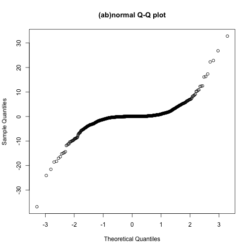
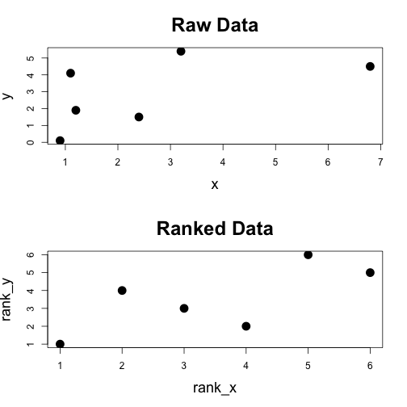
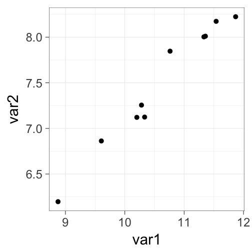
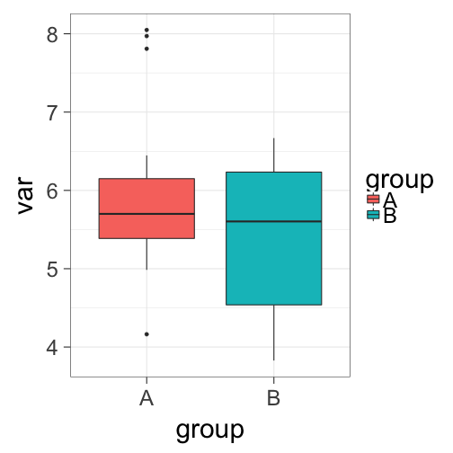
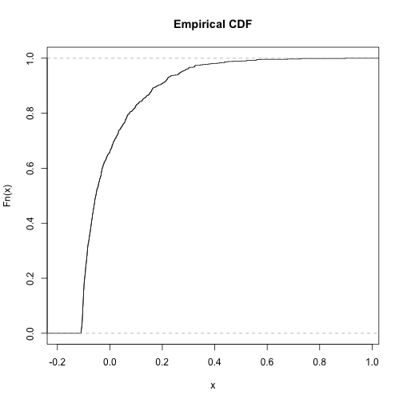
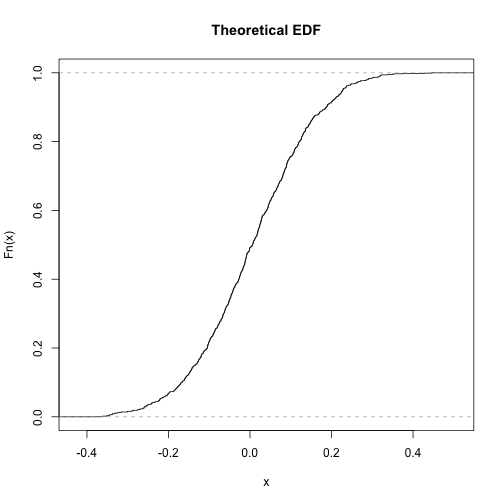

Non Parametric Stats
========================================================
incremental:true

## when your data don't meet the assumptions



WARNING - LOW POWER ZONE
=================
type: alert

If your data meet (or approximate) assumptions of parametrics, they are generally more powerful

Monte-Carlo techniques are also often more powerful than non-parametrics

However, non-parametrics simpler to use than MC

Rank-Order Statistics
============

Non-parametrics are known as rank-order tests, because they work by ranking observations and analyzing these ranks, rather than the data themselves.

To use non-parametrics with continuous values, you have to discard a lot of information.

We will talk about non-parametrics in relation to their parametric equivalents. 

Non-Parametric Regression
===========

Non-parametric regression techniques exist but are not commonly used.

There are, however, several non-parametric correlation techniques that are widely used.

Spearman's Rho
===========


X and Y values are ranked separately, and the Pearson's product-moment coefficient ($r$) is computed on these ranks


```r
x <- c(0.9, 6.8, 3.2, 2.4, 1.2, 1.1)
y <- c(0.1, 4.5, 5.4, 1.5, 1.9, 4.1)
```

Spearman's Rho
=============


```r
rank_x <- rank(x)
rank_y <- rank(y)
rank_x
```

```
[1] 1 6 5 4 3 2
```

```r
rank_y
```

```
[1] 1 5 6 2 3 4
```

Spearman's Rho
============



***


```r
cor(x, y, method = "pearson")
```

```
[1] 0.5590485
```

```r
cor(x, y, method = "spearman")
```

```
[1] 0.7142857
```

```r
cor(rank_x, rank_y, method = "pearson")
```

```
[1] 0.7142857
```

Kendall's Tau
=============

Alternative to Spearman....

*  Rank observations
*  Examine each pair of observations, determine whether they match or not
*  Compute $\tau$

$$\tau = \frac{(number\ of\ matched\ pairs) - (number\ of \ non\ matched\ pairs)}{\frac{1}{2}n(n-1)}$$

Note: the denominator is the total number of pairwise comparisons.

Kendall's Tau
===============
incremental: false



***

```r
cor(var1, var2, method="kendall")
```

```
[1] 0.9555556
```

Non-Parametric t-test
===========

Mann-Whitney U, also known as the Wilcoxon Rank-Sum

*  rank observations, ignoring group
*  sum the ranks belonging to each group
*  calculate the test statistic

$$U = R - \frac{n(n+1)}{2}$$

*  $R$ is the summed ranks, and $n$ is the group sample size
*  do this for both groups, and take the smallest as the test statistic
*  compare to known distribution under null hypothesis

Mann-Whitney U / Wilcoxon Rank-Sum
====================


```r
x <- rnorm(10, mean=5)
y <- rnorm(10, mean=7)
wilcox.test(x,y)
```

```

	Wilcoxon rank sum test

data:  x and y
W = 3, p-value = 7.578e-05
alternative hypothesis: true location shift is not equal to 0
```

Non-Parametric ANOVA
===========

Kruskal-Wallis

*  Rank all observations
*  Calculate the average rank within each group
*  Compare the average rank within group the the overall average of ranks, using a weighted sum-of-squares technique
*  Compare p value of test statistic using chi-square approximation

Kruskal-Wallis
================
incremental: false



Kruskal-Wallis
===============

```r
kruskal.test(var~group)
```

```

	Kruskal-Wallis rank sum test

data:  var by group
Kruskal-Wallis chi-squared = 1.0566, df = 1, p-value = 0.304
```

Goodness of Fit Test
============
incremental:false

Kolmogorov-Smirnov Test

Non-parametric test to determine whether two distributions differ

Based on theoretical vs empirical CDF
========
incremental:false



*** 



KS-Test
=========
The single largest deviation of the empirical from the theoretical is the KS statistic. This is used to compute a p-value.

Can be used for any distribution, not just the normal distribution.

KS-Test in R
=========

```r
ks.test(rnorm(100), "punif")
```

```

	One-sample Kolmogorov-Smirnov test

data:  rnorm(100)
D = 0.52, p-value < 2.2e-16
alternative hypothesis: two-sided
```

KS-Test in R
=========

```r
ks.test(rnorm(100)^2, "pnorm")
```

```

	One-sample Kolmogorov-Smirnov test

data:  rnorm(100)^2
D = 0.5, p-value < 2.2e-16
alternative hypothesis: two-sided
```

Two Sample KS-Test in R
=========


```r
ks.test(runif(100), rnorm(100))
```

```

	Two-sample Kolmogorov-Smirnov test

data:  runif(100) and rnorm(100)
D = 0.59, p-value = 1.554e-15
alternative hypothesis: two-sided
```

