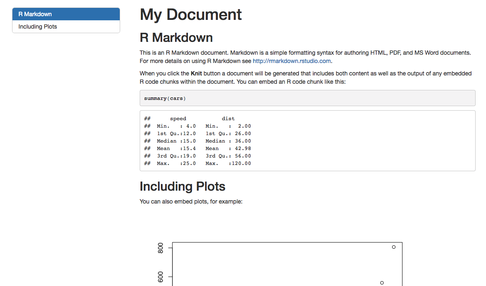

## Section headings {.build}

Pay careful attention to the way you use headings in Rmarkdown.  

*  `#` is the first level heading - this is usually the document title
*  `##` is the second level heading - this should be the main sections of document
*  `###` is the third level heading - for sub-sections within main parts of the document

The key point is, think about the structure of the document, and use the headings consistently. 

<span class="red2">These get used when you use a table of contents for your document.</span>

## Table of Contents {.smaller}

```{}
---
title: "My Document"
output: 
  html_document:
    toc: yes
    toc_float: yes
---
```



## Figure captions {.smaller}

When you create figures in RMarkdown, you can give them captions.  This is good practice:

<pre>```{r, fig.cap="Histogram of normal distribution, n=1000"}
library(ggplot2)
qplot(rnorm(1000))
```</pre>

```{r, fig.cap="Histogram of normal distribution, n=1000", echo=FALSE, message=F, fig.height=3}
library(ggplot2)
qplot(rnorm(1000))
```


## pander - a useful tool for formatting tabular data in R Markdown

By default when you print a dataframe to a markdown document, it doesn't look that great. 

```{r}
head(mtcars)
```

## pander turns the dataframe into something much nicer! {.smaller}

```{r}
library(pander)
pander(mtcars, split.tables = 200)
```

## pander is smart enought to deal with many common output types

So you can pass model objects, summaries, etc

## lm

```{r}
pander(lm(mpg~wt, data=mtcars))
```


## chisq.test

```{r}
pander(chisq.test(mtcars$cyl))
```

## anova

```{r}
pander(anova(lm(mpg~cyl, data=mtcars)))
```

## prcomp

```{r}
pander(summary(prcomp(mtcars)))
```


## Challenge

Test the hypothesis that hair color is related to eye color using this dataset http://hompal-stats.wabarr.com/datasets/hair_eye.txt

Create a new markdown document that has three sections.  Make sure your document has a table of contents.

> * Data Description - describes the dataset
> * Chi-square - performs a chi-square and makes a nice table using `pander`
> * Conclusion - write out your conclusion based on the chi-square


```{r}
```

 
