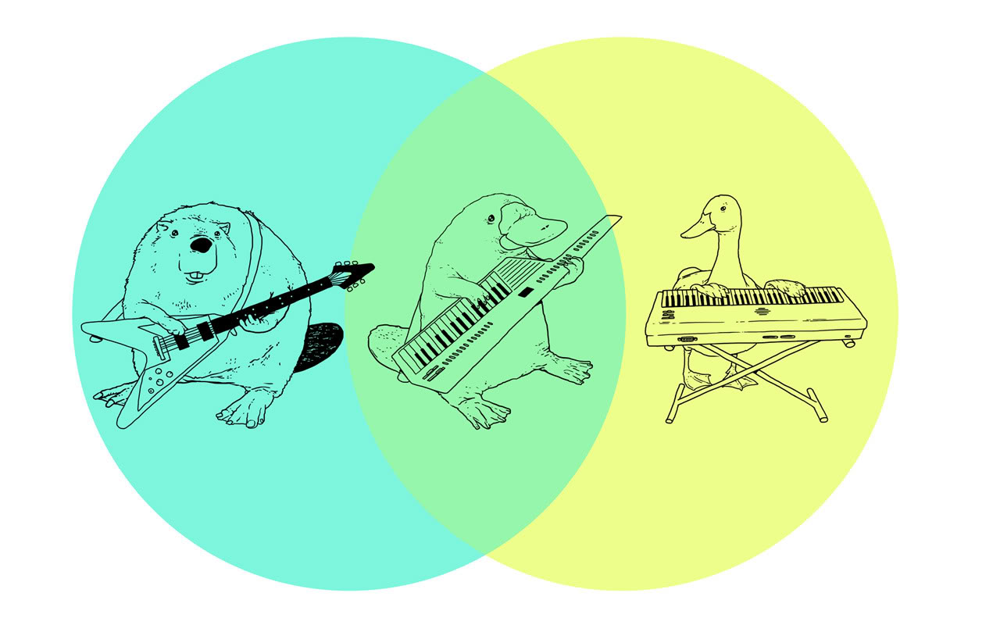
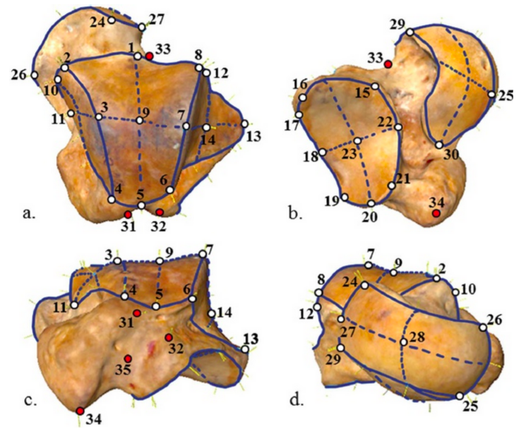

## Multivariate Stats Continued 



## Discriminant Function Analysis {.build}

start with $p$ variables measured for $m$ groups.  

DFA finds a linear combination of the $p$ variables that maximizes the distance between groups

$$Z = a_1X_1 + a_2X_2 + ... + a_pX_p$$

DFA tries to maximise the F ratio of between group to within group variation ($M_B/M_W$)

This is an eigenvalue problem

## Discriminant Function Analysis {.build}


Assuming you have more measurements than groups, there will be $m - 1$ **canonical discriminant functions** that maximize the ratio $M_B/M_W$. 

These are indicated by $Z_1$, $Z_2$, $...$, $Z_{m-1}$.

$Z_1$ captures as much distance between groups as possible. 

$Z_2$ captures as much variation as possible, subject to the condition that the variation captured is uncorrelated (**orthogonal**) to $Z_1$, and so on with the remaining canonical discriminant functions. 

## Discriminant Function Analysis {.build .smaller}

First two discriminant functions often captures majority of group differences.  

If so, we can use  reduced set of variables to visualize $p$ dimensional dataset in 2 dimensions.


## Learn By Doing - DFA in R

```{}
library(MASS)
lda()
```

Do a DFA of the iris data using the `mass::lda()` function


## Correspondence Analysis {.build}


> *  A method for visualizing a 2-way contingency table
> *  The goal is to have rows (often taxa) and colums (often sites) appear in same ordination plot
> *  Often called ***reciprocal averaging***
> *  Site scores are weighted averages of species values, and species scores are a weighted > average of site values
> *  useful for count data and presence/absence

## Correspondence Analysis {.smaller}


```r
bovids <- read.table("http://hompal-stats.wabarr.com/datasets/bovid_occurrences.txt", header=TRUE, sep="\t")
library(tidyr)
bovids <- spread(bovids, key=site, value=count)
row.names(bovids) <- bovids$taxon
bovids<-bovids[,2:9]
head(bovids)
```

```
             site1 site2 site3 site4 site5 site6 site7 site8
Aepyceros      155   219   214   183   295   330   185   369
Connochaetes   185   281   297   276   136   159    86   172
Gazella        184   291   313   295    95    98    61   114
Tragelaphus     91   145   145   155   229   260   137   295
```

## Correspondence Analysis {.smaller}

* `ca` package in R
*  Row points (red) appear close to rows with similar column values
*  Column points (blue) appear close to columns with similar row values


## Correspondence Analysis {.smaller}

Code to do CA and make plot on previous page


```r
library("ca")
myCA <- ca(bovids)
qplot(x=myCA$rowcoord[,1], 
      y=myCA$rowcoord[,2], 
      label=rownames(myCA$rowcoord), 
      size=I(8), 
      geom="text", 
      color=I("blue")) + 
  geom_text(aes(x=myCA$colcoord[,1], 
                y=myCA$colcoord[,2]), 
                label=rownames(myCA$colcoord), 
                size=8, 
                color="red") + 
  labs(x="Dimension 1", y="Dimension 2", title="Corresponce Analysis - Bovid Abundances") + 
  scale_x_continuous(limits=c(-2, 2))
```


## Geometric Morphometrics (GM) 


involves the analysis of Cartesian geometric coordinates rather than length, area, volume measurements

## Steps in a GM analysis {.build}

using the `geomorph` package in R

> 1.  Get coordinate data (e.g., digitize outline from a photo, use a microscribe, get 3D coordinates from laser scanned specimen, etc)
> 2.  Perform a Generalized Procrustes Analysis (GPA)
> 3.  Analyze and visualze the results from the GPA

## GM - Step 1 - Coordinates {.build}




> *  involves capturing homologous ***landmarks*** or ***semi-landmarks***
> *  can be 2D or 3D
> *  each specimen will have a unique ***configuration*** of landmarks in its own coordinate system

## GM - Step 1 - Coordinates {.build .smaller}

We will use 2D coordinate data of salamander head shape

note that the landmark data is in a $p \times k \times n$ array


```
Error in library(geomorph) : there is no package called 'geomorph'
```
