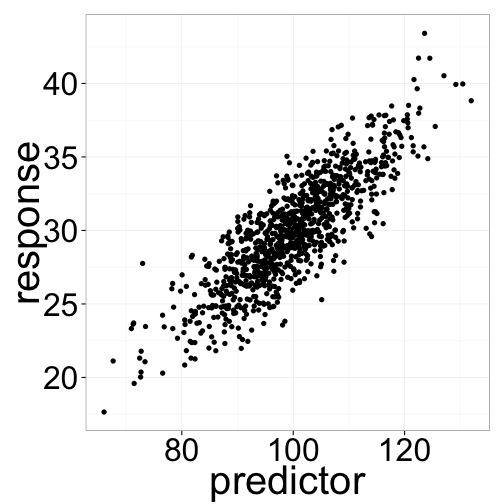

Regression
========================================================
incremental: true
left:10%

***
 


Regression implies X causes Y
==================================
left:60

 

***

Both variables are continuous

TONS of data are suitable for this kind of analysis.

Examples?

From geometry: remember straight line forumula     
       
$$Y = slope*X + intercept$$

Simple Linear Model
===========================

Simplest way two variables can be modeled as related to one another

$$Y_i = \beta_0 + \beta_1X_i + \epsilon_i$$

*  $\beta_0$ is the **intercept** (value of y where x= 0)
*  $\beta_1X_i$ is the **slope** value expressing $\Delta Y / \Delta X$
*  $\epsilon_i$ is the error term
    *  normal random variable with mean 0 and variance $\sigma^2$

This equation should make sense
===========================
incremental:false
left:60

 

***

$$Y_i = \beta_0 + \beta_1X_i + \epsilon_i$$

Once you decide on a line, then the value of Y equals:
  *  the value predicted by the line, plus
  *  a random error from our error term

Finding the best line
======================
left:60

 

***

Once we decide on linear regression, we have to find best line

There is unexplained variation in Y, so points don't fall on straight line (why?)

Many lines pass through $(\bar{X},\bar{Y})$.  How do we pick the best one?


Finding the best line - residuals
======================
left:60
incremental:FALSE

 

***
A **residual** represents the distance between the predited value from the regression, and the actual value.

The **squared residual** is calculated as such: 

$$d_i^2=(Y_i - \hat{Y}_i)^2$$

Finding the best line
======================

The best line minimizes the **residual sum of squares**

$$ RSS=\sum\limits_{i=1}^n(Y_i - \hat{Y}_i)^2$$

We could do a Monte Carlo approach: try a bunch of slopes passing through $(\bar{X},\bar{Y})$ and calculate the RSS, then pick the smallest, but math offers a simpler solution.

Variances and Covariances
=======================
Recall the **sum of squares**:  $$\ SS_Y = \sum\limits_{i=1}^n(Y_i - \bar{Y})^2$$

**Sample variance**:  $$\ s^2_Y=\frac{\sum\limits_{i=1}^n(Y_i - \bar{Y})^2}{n-1}$$

SS equivalent to: $$\ SS_Y = \sum\limits_{i=1}^n(Y_i - \bar{Y})(Y_i - \bar{Y})$$

Variances and Covariances
=======================
With 2 variables, we can define **sum of cross products** $$\ SS_{XY} = \sum\limits_{i=1}^n(X_i - \bar{X})(Y_i - \bar{Y})$$

By analogy to the sample variance, we define **sample covariance** $$\ s_{XY} = \frac{\sum\limits_{i=1}^n(X_i - \bar{X})(Y_i - \bar{Y})}{(n-1)}$$


Sample Covariance - Negative
====================
left:60
incremental: FALSE

 

***

From $-\infty$ to $\infty$

$$\ s_{XY} = \frac{\sum\limits_{i=1}^n(X_i - \bar{X})(Y_i - \bar{Y})}{(n-1)}$$

Sample Covariance - Positive
====================
left:60
incremental: FALSE

 

***

From $-\infty$ to $\infty$

$$\ s_{XY} = \frac{\sum\limits_{i=1}^n(X_i - \bar{X})(Y_i - \bar{Y})}{(n-1)}$$

Calculate Covariance
=======================
By hand on whiteboard


```r
x <- c(2 , 4, 3)
y <- c(1, 5, 6)
```

Regression Parameters - Slope
=================

In **ordinary least squares regression (OLS)**, the slope of the best fit line is defined as: $$ \frac{covariance\ of\ XY}{variance\ of\ X}$$

Or: $$\hat{\beta}_1 = \frac{s_{XY}}{s^2_X} = \frac{SS_{XY}}{SS_X}$$ **note: this simplifies because both are divided by same denomenator**

Regression Parameters - Intercept
=================

The intercept is easy to find, because the best fit line passes through $(\bar{X},\bar{Y})$. Thus:
$$ \bar{Y} =   \hat{\beta}_0 + \hat{\beta}_1 \bar{X} $$

Or:

$$ \hat{\beta}_0 = \bar{Y} - \hat{\beta}_1 \bar{X}$$

Regression Parameters - Error
===================

Recall: $$Y_i = \beta_0 + \beta_1X_i + \epsilon_i$$

Regression assumes that that $\epsilon$ is a random normal variable with mean 0 and variance of $\sigma^2$, which is related to the scatter around the line. 

We estimate $\sigma^2$ like this: $$\frac{RSS}{n-2}$$

The square root of this is **standard error of regression**: $$\hat{\sigma}^2=\sqrt{\frac{RSS}{n-2}}$$

Coefficient of Determination
=====================

In a linear relationship, the total variance we want to explain is $SS_Y$.

Some variance is attribituable to our error term (measured by $RSS$).  

The remaining variance is explained by our regression, thus: $$SS_{reg}=SS_Y-RSS$$

Therefore: $$SS_Y=SS_{reg}+RSS$$ 

This is refered to as **partitioning** a sum of squares.

Coefficient of Determination
=====================

This leads to calculation of $r^2$, AKA the **coefficient of determination**

$$\frac{SS_{reg}}{SS_Y}=\frac{SS_{reg}}{SS_{reg} + RSS}$$

The square root of this value is known as $r$ or the *product-moment correlation coefficient*. Note: the sign of $r$ comes from the sign of the slope of the line. 

Hypothesis Testing
=====================

You will always get parameter estimates for the intercept and slope.  The next question is: **are they signficant?**

The slope measures the strength of the effect of $X$ on $Y$.  The slope is a measure of **effect size**

## What is the null hypothesis about the slope in regression? 

Hypothesis Testing ANOVA tables
=====================
incremental:false

Source | Degrees of Freedom (df) | Sum of squares (SS) | Mean Square (MS) | Expected Mean Square | F-ratio | P-value
----|----|----|----|----|----|----
Regression|1|$SS_{reg}=\sum\limits_{i=1}^n (\hat{Y}_i-\bar{Y})^2$|$\frac{SS_{reg}}{1}$|$\sigma^2 + \beta_i^2 \sum\limits_{i=1}^2 X_i^2$|$\frac{SS_{reg}/1}{RSS/(n-2)}$|F dist
Residual|n-2|$RSS=\sum\limits_{i-1}^n(Y_i - \hat{Y}_i)^2$|$\frac{RSS}{(n-2)}$|$\sigma^2$

*  $\bar{Y}$ = mean of Y
*  $\hat{Y}_i$ = predicted value from regression
*  $Y_i$ = value of Y

Confidence Intervals
======================
incremental:false

We can also construct confidence intervals around our parameter estimates (formulae not shown).

Notice that our intervals are narrowest near the mean, and fatter the further you go away from mean.

Prediction intervals are related, but slightly wider.

***

 

Interpolation vs Extrapolation
=====================

 
***
 

Assumptions of Regression
==============

1.  The causal relationship between X and Y is linear.
2.  The X variable is measured without error.
      * Datasets that don't meet this require Model II (a.k.a., RMA)
3.  Y values are independent with normally distributed errors
4.  Variance is constant along the regression line (homoscedasticity)

Doing Regression in R
====================
incremental:FALSE


```r
myModel <- lm(response~predictor)
summary(myModel)
```


Checking Assumptions: Residual plot
======================
incremental:FALSE
left: 75


```r
plot(lm(response~predictor))
```

    

***

Should look like the stars in the night sky!

Any systematic correlation between the residuals and the fitted is bad.

Checking Assumptions: Residual plot
======================
incremental:False
left: 75


```r
response <- predictor^2 + rnorm(1000, sd=50)
plot(lm(response~predictor))
```

    

***

Systematic departures from linearity can show up in the residual plots


Doing Model II Regression in R
====================
incremental:false

Model II (aka RMA) regression requires a separate package `lmodel2`

The function is different, but the call is still simple.  


```r
library(lmodel2)
lmodel2(response~predictor)
```


Regression In Context
==========================
type:section

Regression is just one (the simplest) of many types of linear models that can describe linear relationships.  

The bigger group comprises the

## General Linear Model


General Linear Model
=======================

Family of statistical models of the form:

$$Y_i = \beta_0 + \beta_1X_i + \beta_2X_i +\ ... +\ \beta_nX_i  + \epsilon_i$$

where: 

* $\beta_0$ is the y-intercept (value of y where x= 0)
*  $\beta_1X_i$ is the slope value for the 1st x variable
*  $\epsilon_i$ is the error term


General Linear Model
=======================

Includes many common statistical methods:

*  Regression
*  Multiple Regression
*  ANOVA
*  ANCOVA

**All of these use the same function in R, called `lm()`**

Choosing a General Linear Model
=======================

First decide which are explanatory and response variables. 

*  All explanatory variables continuous
    *  ***Regression***
*  All explanatory variables categorical
    *  ***ANOVA (Analysis of Variance)***
*  Explanatory variables both continuous and categorical
    *  ***ANCOVA (Analysis of Covariance)***


