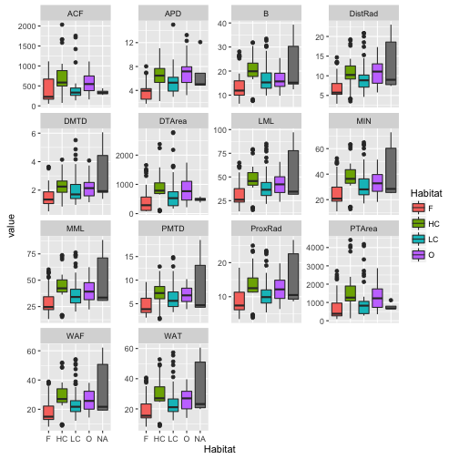

tidyr
========================================================
incremental:true 

## Tidying data and reshaping it

Data Shapes - short versus long
================

```
animal    nToes   size                smell
chicken   4       small               so-so
cow       2       big         objectionable
pig       2       medium  more_objectionable
```

```
animal   variable              value
cow     size                	big
cow    	nToes                     2
cow    	smell         objectionable
pig     size                 medium
pig    	nToes                     2
pig    	smell    more_objectionable
chicken size                  small
chicken nToes                     4
chicken smell                 so-so
```

But the long form is stupid! 
=======================

### Why would I ever use it??

### I'm glad you asked. Two reasons come up most often:

1. You want to take advantage of `group_by()` in the `dplyr` package to do complex stuff

2. You want to take advantage of `facets` in `ggplot2`

## dplyr and ggplot2 **just work better** on the long form (which makes sense, as all these packages are part of the [hadleyverse](http://adolfoalvarez.cl/the-hitchhikers-guide-to-the-hadleyverse/)) 

Example data
==================


```r
library(dplyr)
astrag <- read.table("http://hompal-stats.wabarr.com/datasets/barr_astrag_2014.txt", header=TRUE, sep="\t")
astrag <- tbl_df(astrag)
head(astrag)
```

Three main functions
=============
**`gather()`**  takes multiple columns, and collapse them into two key - value columns (this operation is known as a "pivot"" in spreadsheet land)

**`separate()`**  takes a single column and splits it into two columns based on some text character

**`spread()`**  takes two columns (key - value pairs) and spreads them into separate columns

gather()
==========
incremental:false

Collapses multiple columns into two key - value pairs

Makes it easier to get the full benefit from `ggplot2`


```r
library(tidyr)
library(ggplot2)
gAstrag <- astrag %>% 
           gather(key="measurement", 
                  value="value", ACF:WAT)
qplot(x=Habitat, y=value, data=gAstrag, 
      fill= Habitat, geom="boxplot") + 
      facet_wrap(facets=~measurement, 
                 scales="free_y")
```

gather()
==========

Makes it easier to get the full benefit from ggplot2



separate()
==========

takes a single column and splits it into two based on some text character


```r
gAstrag %>% 
  select(individual, Taxon) %>%
  separate(Taxon, into = c("genus", "species"), sep = "_")
```

```
# A tibble: 2,618 x 3
   individual      genus    species
*      <fctr>      <chr>      <chr>
1   AMNH81690  Aepyceros   melampus
2   AMNH82050  Aepyceros   melampus
3   AMNH83534  Aepyceros   melampus
4   AMNH85150  Aepyceros   melampus
5  AMNH233038 Alcelaphus buselaphus
6   AMNH34717 Alcelaphus buselaphus
7   AMNH34725 Alcelaphus buselaphus
8   AMNH82033 Alcelaphus buselaphus
9   AMNH82159 Alcelaphus buselaphus
10  AMNH88406  Beatragus    hunteri
# ... with 2,608 more rows
```

spread()
===========

Does the opposite of `gather()`.  It takes long form data and spreads it across new columns.  Used less often than `gather()`


```r
spreadAstrag <- gAstrag %>%
  spread(key=measurement, value=value)
names(spreadAstrag)
```

```
 [1] "individual" "Taxon"      "Habitat"    "ACF"        "APD"       
 [6] "B"          "DistRad"    "DMTD"       "DTArea"     "LML"       
[11] "MIN"        "MML"        "PMTD"       "ProxRad"    "PTArea"    
[16] "WAF"        "WAT"       
```
